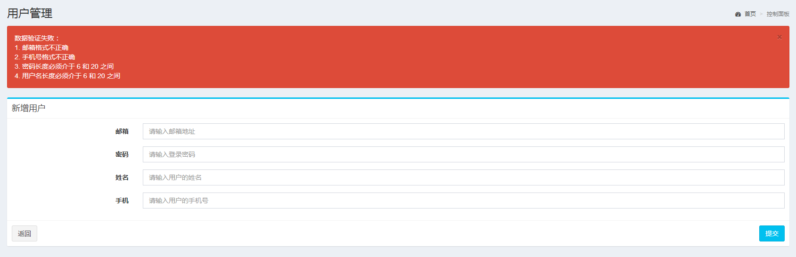

# Java工具类

## SpringContext

### Bean工具类

```java
package com.shooter.funtl.common.context;

import org.apache.commons.lang3.Validate;
import org.springframework.beans.BeansException;
import org.springframework.beans.factory.DisposableBean;
import org.springframework.context.ApplicationContext;
import org.springframework.context.ApplicationContextAware;

@Component
public class SpringContext implements ApplicationContextAware,DisposableBean{
    
    private static ApplicationContext applicationContext;

    /**
     * 容器停止时调用
     * */
    public void destroy() throws Exception {
        applicationContext = null;
    }

    /**
     * 将web.xml生成的ApplicationContext实例装载到applicationContext中
     * */
    public void setApplicationContext(ApplicationContext applicationContext) 
        							throws BeansException {
        SpringContext.applicationContext = applicationContext;
    }

    /**
     * 根据类获取实例
     * */
    public static <T> T getBean(Class<T> clazz){
        Validate.validState(applicationContext != null,"ApplicationContext 未被成功加载！");
        return applicationContext.getBean(clazz);
    }

    /**
     * 根据beanId获取实例
     * */
    public static <T> T getBean(String beanId){
        Validate.validState(applicationContext != null,"ApplicationContext 未被成功加载！");
        return (T)applicationContext.getBean(beanId);
    }
}
```


### 使用示例

```java
/**
* 根据类获取实例
* */
public class LoginController extends HttpServlet
    private UserService userService = SpringContext.getBean(UserServiceImpl.class);
}

/**
* 根据beanId获取实例
* */
public class UserServiceImpl implements UserService {
    private UserDao userDao = SpringContext.getBean("userDao");
}
```


## SpringValidation

​	　`JSR-303` 用于对 `Java Bean` 中的字段的值进行验证，其是 `JavaEE 6` 中的一项子规范，叫做 `Bean Validation`。`Spring MVC 3.x` 之中也大力支持 `JSR-303`，可以在控制器中使用注解的方式对表单提交的数据方便地验证，`Spring 4.0` 开始支持 `Bean Validation` 功能。


### 基本的校验规则

（1）空检查

```xml
@Null 验证对象是否为 null
@NotNull 验证对象是否不为 null, 无法查检长度为 0 的字符串
@NotBlank 检查约束字符串是不是 Null 还有被 Trim 的长度是否大于 0,只对字符串,且会去掉前后空格
@NotEmpty 检查约束元素是否为 NULL 或者是 EMPTY
```

（2）布尔检查

```
@AssertTrue 验证 Boolean 对象是否为 true
@AssertFalse 验证 Boolean 对象是否为 false
```

（3）长度检查

```
@Size(min=, max=) 验证对象（Array, Collection , Map, String）长度是否在给定的范围之内
@Length(min=, max=) 验证字符串长度介于 min 和 max 之间
```

（4）日期检查

```
@Past 验证 Date 和 Calendar 对象是否在当前时间之前，验证成立的话被注释的元素一定是一个过去的日期
@Future 验证 Date 和 Calendar 对象是否在当前时间之后 ，验证成立的话被注释的元素一定是一个将来的日期
```

（5）正则检查

```
@Pattern 验证 String 对象是否符合正则表达式的规则，被注释的元素符合制定的正则表达式
regexp：正则表达式
flags：指定 Pattern.Flag 的数组，表示正则表达式的相关选项
```

（5）数值检查

​	　建议使用在 `String` 、`Integer` 类型，不建议使用在 `int` 类型上，因为表单值为 `“”` 时无法转换为 `int`，但可以转换为 `String` 为 `“”`，`Integer` 为 `null`。

```
@Min 验证 Number 和 String 对象是否大等于指定的值
@Max 验证 Number 和 String 对象是否小等于指定的值
@DecimalMax 被标注的值必须不大于约束中指定的最大值. 这个约束的参数是一个通过 BigDecimal 定义的最大值的字符串表示 .小数 存在精度
@DecimalMin 被标注的值必须不小于约束中指定的最小值. 这个约束的参数是一个通过 BigDecimal 定义的最小值的字符串表示 .小数 存在精度
@Digits 验证 Number 和 String 的构成是否合法
@Digits(integer=,fraction=) 验证字符串是否是符合指定格式的数字，integer 指定整数精度，fraction 指定小数精度
@Range(min=, max=) 被指定的元素必须在合适的范围内
@Range(min=10000,max=50000,message=”range.bean.wage”)
@Valid 递归的对关联对象进行校验, 如果关联对象是个集合或者数组，那么对其中的元素进行递归校验，如果是一个 map，则对其中的值部分进行校验.(是否进行递归验证)
@CreditCardNumber 信用卡验证
@Email 验证是否是邮件地址，如果为 null，不进行验证，算通过验证
@ScriptAssert(lang= ,script=, alias=)
@URL(protocol=,host=, port=,regexp=, flags=)
```


### BeanValidator

​	　首先，需要引入`Hibernate Validator`验证需要使用的`Jar`包。

```xml
<dependency>
    <groupId>org.hibernate</groupId>
    <artifactId>hibernate-validator</artifactId>
    <version>5.3.4.Final</version>
</dependency>
```

​	　然后，新建`Hibernate Validator`的封装工具类`BeanValidator`.。

```java
import org.springframework.beans.factory.annotation.Autowired;
import javax.validation.ConstraintViolation;
import javax.validation.ConstraintViolationException;
import javax.validation.Validator;
import java.util.ArrayList;
import java.util.HashMap;
import java.util.List;
import java.util.Map;
import java.util.Set;

/**
 * JSR303 Validator(Hibernate Validator)工具类
 */
public class BeanValidator {

    @Autowired
    private static Validator validator;

    public static void setValidator(Validator validator) {
        BeanValidator.validator = validator;
    }

    /**
     * 调用 JSR303 的 validate 方法, 验证失败时抛出 ConstraintViolationException.
     */
    private static void validateWithException(Validator validator, Object object, Class<?>... groups) throws ConstraintViolationException {
        Set constraintViolations = validator.validate(object, groups);
        if (!constraintViolations.isEmpty()) {
            throw new ConstraintViolationException(constraintViolations);
        }
    }

    /**
     * 辅助方法, 转换 ConstraintViolationException 中的 Set<ConstraintViolations> 中为 List<message>.
     */
    private static List<String> extractMessage(ConstraintViolationException e) {
        return extractMessage(e.getConstraintViolations());
    }

    /**
     * 辅助方法, 转换 Set<ConstraintViolation> 为 List<message>
     */
    private static List<String> extractMessage(Set<? extends ConstraintViolation> constraintViolations) {
        List<String> errorMessages = new ArrayList<>();
        for (ConstraintViolation violation : constraintViolations) {
            errorMessages.add(violation.getMessage());
        }
        return errorMessages;
    }

    /**
     * 辅助方法, 转换 ConstraintViolationException 中的 Set<ConstraintViolations> 为 Map<property, message>.
     */
    private static Map<String, String> extractPropertyAndMessage(ConstraintViolationException e) {
        return extractPropertyAndMessage(e.getConstraintViolations());
    }

    /**
     * 辅助方法, 转换 Set<ConstraintViolation> 为 Map<property, message>.
     */
    private static Map<String, String> extractPropertyAndMessage(Set<? extends ConstraintViolation> constraintViolations) {
        Map<String, String> errorMessages = new HashMap<>();
        for (ConstraintViolation violation : constraintViolations) {
            errorMessages.put(violation.getPropertyPath().toString(), violation.getMessage());
        }
        return errorMessages;
    }

    /**
     * 辅助方法, 转换 ConstraintViolationException 中的 Set<ConstraintViolations> 为 List<propertyPath message>.
     */
    private static List<String> extractPropertyAndMessageAsList(ConstraintViolationException e) {
        return extractPropertyAndMessageAsList(e.getConstraintViolations(), " ");
    }

    /**
     * 辅助方法, 转换 Set<ConstraintViolations> 为 List<propertyPath message>.
     */
    private static List<String> extractPropertyAndMessageAsList(Set<? extends ConstraintViolation> constraintViolations) {
        return extractPropertyAndMessageAsList(constraintViolations, " ");
    }

    /**
     * 辅助方法, 转换 ConstraintViolationException 中的 Set<ConstraintViolations> 为 List<propertyPath + separator + message>.
     */
    private static List<String> extractPropertyAndMessageAsList(ConstraintViolationException e, String separator) {
        return extractPropertyAndMessageAsList(e.getConstraintViolations(), separator);
    }

    /**
     * 辅助方法, 转换 Set<ConstraintViolation> 为 List<propertyPath + separator + message>.
     */
    private static List<String> extractPropertyAndMessageAsList(Set<? extends ConstraintViolation> constraintViolations, String separator) {
        List<String> errorMessages = new ArrayList<>();
        for (ConstraintViolation violation : constraintViolations) {
            errorMessages.add(violation.getPropertyPath() + separator + violation.getMessage());
        }
        return errorMessages;
    }

    /**
     * 服务端参数有效性验证
     *
     * @param object 验证的实体对象
     * @param groups 验证组
     * @return 验证成功：返回 null；验证失败：返回错误信息
     */
    public static String validator(Object object, Class<?>... groups) {
        try {
            validateWithException(validator, object, groups);
        } catch (ConstraintViolationException ex) {
            List<String> list = extractMessage(ex);
            list.add(0, "数据验证失败：");

            // 封装错误消息为字符串
            StringBuilder sb = new StringBuilder();
            for (int i = 0; i < list.size(); i++) {
                String exMsg = list.get(i);
                if (i != 0 ){
                    sb.append(String.format("%s. %s", i, exMsg)).append(list.size() > 1 ? "<br/>" : "");
                } else {
                    sb.append(exMsg).append(list.size() > 1 ? "<br/>" : "");
                }
            }

            return sb.toString();
        }

        return null;
    }
}
```


### 使用示例

​	　首先，只需要在实体类的属性上使用 `JSR-303` 注解即可完成相关数据的验证工作。

```java
@Length(min = 6, max = 20, message = "用户名长度必须介于 6 和 20 之间")
private String username;

@Length(min = 6, max = 20, message = "密码长度必须介于 6 和 20 之间")
private String password;

@Pattern(regexp = RegexpUtils.PHONE, message = "手机号格式不正确")
private String phone;

@Pattern(regexp = RegexpUtils.EMAIL, message = "邮箱格式不正确")
private String email;
```

​	　接着，修改 `spring-context.xml` 文件，注入 `Validator` 工具类，配置如下：

```xml
<!-- 配置 Bean Validator 定义 -->
<bean id="validator" class="org.springframework.validation.beanvalidation.LocalValidatorFactoryBean"/>
<bean id="beanValidator" class="com.funtl.my.shop.commons.validator.BeanValidator">
    <property name="validator" ref="validator" />
</bean>
```

​	　配置完成后，在浏览器端测试直接提交数据，效果如下：




## CookieUtils

​	　**Cookie** 是指存储在用户**本地终端**上的数据（存储空间为 **4k**），同时它是与具体的 Web 页面或者站点相关的。Cookie 数据会自动在 `Web 浏览器`和 `Web 服务器`之间传输，也就是说 HTTP 请求发送时，会把保存在该请求**域名下的所有 Cookie 值发送给 Web 服务器**，服务器端脚本是可以**读、写**存储在客户端的 Cookie 的操作。

::: details 其他浏览器端存储技术

- LocalStorage：HTML5新特性，**解决了 Cookie 存储空间不足的问题**(一般浏览器支持5M)，可以永久存储
- SessionStorage：当**会话**结束的时候SessionStorage 中的键值对就会被清空
- userData ：是 **IE 浏览器专属**，它的容量可以达到 640K
- globalStorage： 适用于 **Firefox** 2+ 的浏览器，类似于 IE 的 userData
- google gear ：是**谷歌**开发出的一种本地存储技术，需要安装 Gear 组件
- Flash Cookie：可以**跨浏览器**，而且清楚缓存不能使其失效，但需要安装Flash 控件
:::

### Cookie工具类

```java
package com.shooter.funtl.common.utils;

import javax.servlet.http.Cookie;
import javax.servlet.http.HttpServletRequest;
import javax.servlet.http.HttpServletResponse;
import java.io.UnsupportedEncodingException;
import java.net.URLDecoder;
import java.net.URLEncoder;

/**
 * Cookie 工具类
 */
public final class CookieUtils {

    /**
     * 得到Cookie的值, 不编码
     */
    public static String getCookieValue(HttpServletRequest request, String cookieName) {
        return getCookieValue(request, cookieName, false);
    }

    /**
     * 得到Cookie的值
     */
    public static String getCookieValue(HttpServletRequest request, String cookieName, boolean isDecoder) {
        Cookie[] cookieList = request.getCookies();
        if (cookieList == null || cookieName == null) {
            return null;
        }
        String retValue = null;
        try {
            for (int i = 0; i < cookieList.length; i++) {
                if (cookieList[i].getName().equals(cookieName)) {
                    if (isDecoder) {
                        retValue = URLDecoder.decode(cookieList[i].getValue(), "UTF-8");
                    } else {
                        retValue = cookieList[i].getValue();
                    }
                    break;
                }
            }
        } catch (UnsupportedEncodingException e) {
            e.printStackTrace();
        }
        return retValue;
    }

    /**
     * 得到Cookie的值
     */
    public static String getCookieValue(HttpServletRequest request, String cookieName, String encodeString) {
        Cookie[] cookieList = request.getCookies();
        if (cookieList == null || cookieName == null) {
            return null;
        }
        String retValue = null;
        try {
            for (int i = 0; i < cookieList.length; i++) {
                if (cookieList[i].getName().equals(cookieName)) {
                    retValue = URLDecoder.decode(cookieList[i].getValue(), encodeString);
                    break;
                }
            }
        } catch (UnsupportedEncodingException e) {
            e.printStackTrace();
        }
        return retValue;
    }

    /**
     * 设置Cookie的值 不设置生效时间默认浏览器关闭即失效,也不编码
     */
    public static void setCookie(HttpServletRequest request, HttpServletResponse response, String cookieName,
                                 String cookieValue) {
        setCookie(request, response, cookieName, cookieValue, -1);
    }

    /**
     * 设置Cookie的值 在指定时间内生效,但不编码
     */
    public static void setCookie(HttpServletRequest request, HttpServletResponse response, String cookieName,
                                 String cookieValue, int cookieMaxage) {
        setCookie(request, response, cookieName, cookieValue, cookieMaxage, false);
    }

    /**
     * 设置Cookie的值 不设置生效时间,但编码
     */
    public static void setCookie(HttpServletRequest request, HttpServletResponse response, String cookieName,
                                 String cookieValue, boolean isEncode) {
        setCookie(request, response, cookieName, cookieValue, -1, isEncode);
    }

    /**
     * 设置Cookie的值 在指定时间内生效, 编码参数
     */
    public static void setCookie(HttpServletRequest request, HttpServletResponse response, String cookieName,
                                 String cookieValue, int cookieMaxage, boolean isEncode) {
        doSetCookie(request, response, cookieName, cookieValue, cookieMaxage, isEncode);
    }

    /**
     * 设置Cookie的值 在指定时间内生效, 编码参数(指定编码)
     */
    public static void setCookie(HttpServletRequest request, HttpServletResponse response, String cookieName,
                                 String cookieValue, int cookieMaxage, String encodeString) {
        doSetCookie(request, response, cookieName, cookieValue, cookieMaxage, encodeString);
    }

    /**
     * 删除Cookie带cookie域名
     */
    public static void deleteCookie(HttpServletRequest request, HttpServletResponse response,
                                    String cookieName) {
        doSetCookie(request, response, cookieName, "", -1, false);
    }

    /**
     * 设置Cookie的值，并使其在指定时间内生效
     *
     * @param cookieMaxage cookie生效的最大秒数
     */
    private static final void doSetCookie(HttpServletRequest request, HttpServletResponse response,
                                          String cookieName, String cookieValue, int cookieMaxage, boolean isEncode) {
        try {
            if (cookieValue == null) {
                cookieValue = "";
            } else if (isEncode) {
                cookieValue = URLEncoder.encode(cookieValue, "utf-8");
            }
            Cookie cookie = new Cookie(cookieName, cookieValue);
            if (cookieMaxage > 0){
                cookie.setMaxAge(cookieMaxage);
            }
            // 设置域名的cookie
            if (null != request) {
                String domainName = getDomainName(request);
                if (!"localhost".equals(domainName)) {
                    cookie.setDomain(domainName);
                }
            }
            cookie.setPath("/");
            response.addCookie(cookie);
        } catch (Exception e) {
            e.printStackTrace();
        }
    }

    /**
     * 设置Cookie的值，并使其在指定时间内生效
     *
     * @param cookieMaxage cookie生效的最大秒数
     */
    private static final void doSetCookie(HttpServletRequest request, HttpServletResponse response,
                                          String cookieName, String cookieValue, int cookieMaxage, String encodeString) {
        try {
            if (cookieValue == null) {
                cookieValue = "";
            } else {
                cookieValue = URLEncoder.encode(cookieValue, encodeString);
            }
            Cookie cookie = new Cookie(cookieName, cookieValue);
            if (cookieMaxage > 0){
                cookie.setMaxAge(cookieMaxage);
            }
            // 设置域名的cookie
            if (null != request) {
                String domainName = getDomainName(request);
                if (!"localhost".equals(domainName)) {
                    cookie.setDomain(domainName);
                }
            }
            cookie.setPath("/");
            response.addCookie(cookie);
        } catch (Exception e) {
            e.printStackTrace();
        }
    }

    /**
     * 得到cookie的域名
     */
    private static final String getDomainName(HttpServletRequest request) {
        String domainName = null;

        String serverName = request.getRequestURL().toString();
        if (serverName == null || serverName.equals("")) {
            domainName = "";
        } else {
            serverName = serverName.toLowerCase();
            serverName = serverName.substring(7);
            final int end = serverName.indexOf("/");
            serverName = serverName.substring(0, end);
            final String[] domains = serverName.split("\\.");
            int len = domains.length;
            if (len > 3) {
                // www.xxx.com.cn
                domainName = "." + domains[len - 3] + "." + domains[len - 2] + "." + domains[len - 1];
            } else if (len <= 3 && len > 1) {
                // xxx.com or xxx.cn
                domainName = "." + domains[len - 2] + "." + domains[len - 1];
            } else {
                domainName = serverName;
            }
        }

        if (domainName != null && domainName.indexOf(":") > 0) {
            String[] ary = domainName.split("\\:");
            domainName = ary[0];
        }
        return domainName;
    }

}
```


### 使用示例

​	　通过`CookieUtils`工具类中的`setCookie方法`可以设置`Cookie键值对`，设置完成后，重启项目，按`F12`即可在`console`中看到设置的Cookies的键值对。此外，设置和删除Cookie键值，可以使用`POST`请求，但是，**获取Cookie键值，只能通过`GET`请求获取**，具体参考[这里](../myshop/myshop-login.html#v1-4-记住我)。特别注意：**cookie不支持分号**。

```java
//设置Cookie键值对，以及生效时间为7天
CookieUtils.setCookie(req,resp,"键","值",7 * 24 * 60 * 60);
//删除指定的Cookie键值对
CookieUtils.deleteCookie(req,resp,"键");
//获取键值对
CookieUtils.getCookieValue(req, "键")
```


## RegexpUtils

### 正则工具类

```java
package com.shooter.funtl.common.utils;

/**
 * 正则表达式工具类
 */
public class RegexpUtils {
    /**
     * 验证手机号
     */
    public static final String PHONE = "^((13[0-9])|(15[^4,\\D])|(18[0,5-9]))\\d{8}$";

    /**
     * 验证邮箱地址
     */
    public static final String EMAIL = "\\w+(\\.\\w)*@\\w+(\\.\\w{2,3}){1,3}";

    /**
     * 验证手机号
     * @param phone
     * @return
     */
    public static boolean checkPhone(String phone) {
        return phone.matches(PHONE);
    }

    /**
     * 验证邮箱
     * @param email
     * @return
     */
    public static boolean checkEmail(String email) {
        return email.matches(EMAIL);
    }
}
```


### 使用示例

```java
if(!RegexpUtils.checkPhone(String.valueOf(user.getPhone()))){
    return BaseResult.fail("手机格式不正确，请重新输入！");
}
```


## MapperUtils

### Jackson工具类

```java
import com.fasterxml.jackson.annotation.JsonInclude;
import com.fasterxml.jackson.core.type.TypeReference;
import com.fasterxml.jackson.databind.DeserializationFeature;
import com.fasterxml.jackson.databind.JavaType;
import com.fasterxml.jackson.databind.ObjectMapper;
import java.util.ArrayList;
import java.util.HashMap;
import java.util.List;
import java.util.Map;

/**
 * Jackson 工具类
 */
public class MapperUtils {
    private final static ObjectMapper objectMapper = new ObjectMapper();

    public static ObjectMapper getInstance() {
        return objectMapper;
    }

    /**
     * 转换为 JSON 字符串
     *
     * @param obj
     * @return
     * @throws Exception
     */
    public static String obj2json(Object obj) throws Exception {
        return objectMapper.writeValueAsString(obj);
    }

    /**
     * 转换为 JSON 字符串，忽略空值
     *
     * @param obj
     * @return
     * @throws Exception
     */
    public static String obj2jsonIgnoreNull(Object obj) throws Exception {
        ObjectMapper mapper = new ObjectMapper();
        mapper.setSerializationInclusion(JsonInclude.Include.NON_NULL);
        return mapper.writeValueAsString(obj);
    }

    /**
     * 转换为 JavaBean
     *
     * @param jsonString
     * @param clazz
     * @return
     * @throws Exception
     */
    public static <T> T json2pojo(String jsonString, Class<T> clazz) throws Exception {
        objectMapper.configure(DeserializationFeature.ACCEPT_SINGLE_VALUE_AS_ARRAY, true);
        return objectMapper.readValue(jsonString, clazz);
    }

    /**
     * 字符串转换为 Map<String, Object>
     *
     * @param jsonString
     * @return
     * @throws Exception
     */
    public static <T> Map<String, Object> json2map(String jsonString) throws Exception {
        ObjectMapper mapper = new ObjectMapper();
        mapper.setSerializationInclusion(JsonInclude.Include.NON_NULL);
        return mapper.readValue(jsonString, Map.class);
    }

    /**
     * 字符串转换为 Map<String, T>
     */
    public static <T> Map<String, T> json2map(String jsonString, Class<T> clazz) throws Exception {
        Map<String, Map<String, Object>> map = objectMapper.readValue(jsonString, new TypeReference<Map<String, T>>() {
        });
        Map<String, T> result = new HashMap<String, T>();
        for (Map.Entry<String, Map<String, Object>> entry : map.entrySet()) {
            result.put(entry.getKey(), map2pojo(entry.getValue(), clazz));
        }
        return result;
    }

    /**
     * 深度转换 JSON 成 Map
     *
     * @param json
     * @return
     */
    public static Map<String, Object> json2mapDeeply(String json) throws Exception {
        return json2MapRecursion(json, objectMapper);
    }

    /**
     * 把 JSON 解析成 List，如果 List 内部的元素存在 jsonString，继续解析
     *
     * @param json
     * @param mapper 解析工具
     * @return
     * @throws Exception
     */
    private static List<Object> json2ListRecursion(String json, ObjectMapper mapper) throws Exception {
        if (json == null) {
            return null;
        }

        List<Object> list = mapper.readValue(json, List.class);

        for (Object obj : list) {
            if (obj != null && obj instanceof String) {
                String str = (String) obj;
                if (str.startsWith("[")) {
                    obj = json2ListRecursion(str, mapper);
                } else if (obj.toString().startsWith("{")) {
                    obj = json2MapRecursion(str, mapper);
                }
            }
        }

        return list;
    }

    /**
     * 把 JSON 解析成 Map，如果 Map 内部的 Value 存在 jsonString，继续解析
     *
     * @param json
     * @param mapper
     * @return
     * @throws Exception
     */
    private static Map<String, Object> json2MapRecursion(String json, ObjectMapper mapper) throws Exception {
        if (json == null) {
            return null;
        }

        Map<String, Object> map = mapper.readValue(json, Map.class);

        for (Map.Entry<String, Object> entry : map.entrySet()) {
            Object obj = entry.getValue();
            if (obj != null && obj instanceof String) {
                String str = ((String) obj);

                if (str.startsWith("[")) {
                    List<?> list = json2ListRecursion(str, mapper);
                    map.put(entry.getKey(), list);
                } else if (str.startsWith("{")) {
                    Map<String, Object> mapRecursion = json2MapRecursion(str, mapper);
                    map.put(entry.getKey(), mapRecursion);
                }
            }
        }

        return map;
    }

    /**
     * 将 JSON 数组转换为集合
     *
     * @param jsonArrayStr
     * @param clazz
     * @return
     * @throws Exception
     */
    public static <T> List<T> json2list(String jsonArrayStr, Class<T> clazz) throws Exception {
        JavaType javaType = getCollectionType(ArrayList.class, clazz);
        List<T> list = (List<T>) objectMapper.readValue(jsonArrayStr, javaType);
        return list;
    }


    /**
     * 获取泛型的 Collection Type
     *
     * @param collectionClass 泛型的Collection
     * @param elementClasses  元素类
     * @return JavaType Java类型
     * @since 1.0
     */
    public static JavaType getCollectionType(Class<?> collectionClass, Class<?>... elementClasses) {
        return objectMapper.getTypeFactory().constructParametricType(collectionClass, elementClasses);
    }

    /**
     * 将 Map 转换为 JavaBean
     *
     * @param map
     * @param clazz
     * @return
     */
    public static <T> T map2pojo(Map map, Class<T> clazz) {
        return objectMapper.convertValue(map, clazz);
    }

    /**
     * 将 Map 转换为 JSON
     *
     * @param map
     * @return
     */
    public static String mapToJson(Map map) {
        try {
            return objectMapper.writeValueAsString(map);
        } catch (Exception e) {
            e.printStackTrace();
        }
        return "";
    }

    /**
     * 将 JSON 对象转换为 JavaBean
     *
     * @param obj
     * @param clazz
     * @return
     */
    public static <T> T obj2pojo(Object obj, Class<T> clazz) {
        return objectMapper.convertValue(obj, clazz);
    }
}
```


### 使用示例


## HttpClient

## Kaptcha


