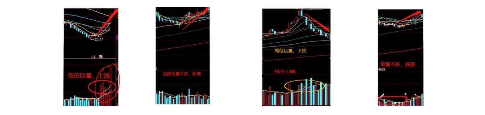
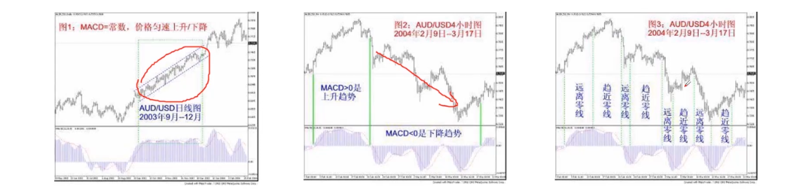

# 基于Python的股票分析与量化交易入门到实践

> [教程地址](https://www.bilibili.com/video/BV1rESFYeEuA?spm_id_from=333.788.videopod.episodes&vd_source=f87f39b1af12eeb6301c7d9944f97ec9)


​	　量化交易是涉及**金融学、数学和编程**的交叉学科。如金融工程、金融衍生品、会计学、概率学、统计学、博弈论、计算机编程、机器学习、大数据都是相关学科。


## 股票基础知识

### 什么是股票

​	　**股票**是指**股份公司**为**筹集资金**而发行给各个股东作为**持股**凭证并借此取得**股息**和**红利**的一种**有价证券**。


**1、股票的分类**

​	　**蓝筹股**是指经营业绩长期稳定增长的大公司，一般都是行业的**龙头企业**，市值在5000亿以上，不管行业景不景气都能赚到钱，一般都**有稳定的现金分红**。

​	　**白马股**是指**长期业绩稳定**、业绩成长性高，有较强的分配能力、分红不错，市值在3000亿以下，一般集中在**消费领域**。

​	　**成长股**成长性高于白马股，公司正**处于高速发展的阶段**，业绩增长远超整个行业，一般为有发展前景的中小公司，以**高新技术和科技类**的为主。

​	　**周期股**是业绩**随经济周期波动**明显，多为工业基础原材料的大宗商品、机械、造船等制造业，港口、远洋运输等航运业以及汽车、房地产这样的非生活必需品行业。

​	　**概念股**是具有某种特别内涵的股票，这一内涵通常会被当作一种选股和炒作的题材，成为股市的热点。


**2、股票行业分类**

​	　[中证行业分类标准](https://www.csindex.com.cn/#/indices/family/list?indexseries=2&custom=0&sharelndex=18)划分为四级，分为11个一级行业、35个二级行业90余个三级行业及200余个四级行业。该标准由中证指数公司发布，现行版本为2021年12月修订，中证行业分类标准相对“官方”，**更接近监管行业分类，并同国际接轨**。

​	　[申万行业分类标准](https://www.swsresearch.com/institute_sw/allIndex/downloadCenter/industryType)划分为三级，分为31个一级行业、134个二级行业和346个三级行业。该标准由申万宏源研究所发布，现行版本为2021年8月修订，申万行业分类标准相对“务实”，**更接近中国行业国情特征**。


### 股价与股票交易

​	　**股价**是股票的**交易价格**，与股票的价值是相对的概念。股票价值的真实含义是企业资产的价值。而股价的价值就等于**每股收益乘以收益率**。


**1、交易名称解释**

​	　**股价**是股票的报价，单位是股，交易单位是手，100股=1手，股价变动单位最小为0.01元。

​	　**庄家**是能够影响金融证券市场行情的大户投资者；**散户**是股市中投入股市资金量较小的个人投资者。

​	　**换手率**是某段时间内的成交量/发行总股数，表示该股票交易的活跃程度。10% ~ 15%非常活跃，低于1%非常不活跃。

​	　**市盈率**（PE）=  每股市场价格/每股税后利润。PE越高，该企业越被高估，反之越被低估。

​	　**K线**是指将各种股票每日、每周、每月开盘价、收盘价、最高价和最低价等涨跌变化状况用图形方式表现出来，即蜡烛图。


**2、基本面分析**

​	　**选股时**可以先通过**基本面分析**一家上市公司在发展过程中所面临的**外部因素**以及其**自身的因素**，来预测其未来的发展前景，并以此来判断该上市公司的股票是否值得买入。

​	　其外部因素有经济增长、财政政策、利率变化；内部因素有经营状况、行业地位和财务状况。

​	　而**股票估值**是基本面选股的核心方法。股票估值能够帮助投资者发现价值被低估的股票，让他们低买高卖，从而获利。

```
常用的指标如下：
- 每股收益：越高越好，代表公司的盈利水平
- 市盈率：同行业市盈率越低越好，14-30倍正常，大于30属于高估，50倍以上存在泡沫
- 净资产收益率：代表公司盈利能力，ROE长期保持在20%以上的就是白马股
- 资产负债率：适中为好，最好在10% ~ 40%，过高容易暴雷，过低发展保守
- 净利润增速：代表公司未来成长能力
             近3年平均增速在20%以上属于优质企业，50%以上属于成长股
```

**3、择时**

​	　择时是**买入股票和卖出股票的时机**，可以从K线形态、成交量、均线、布林带、MACD、KDJ等方面出发，他们是反应股价变化的指标。

（1） K线图

​	　能显示股价的强弱、多空双发的力量对比，是技术分析最常见的工具。

（2） 成交量

​	　在股市中，成交量不仅可以反映出买卖数量的变化，还可以通过成交量看出多空双方的力量对比。



（3）均线

​	　将某一段时间的收盘价之和除以该周期所得到的一根平均线。常用的参数有5日、10日、20日、30日和60日等。

（4）布林带

​	　由三条轨道线组成，其上下两条线分别可以看成是价格的压力线和支撑线，在两条线之间是一条价格平均线。


（5）MACD

​	　异同移动平均线，表示股价的变化速度




（6）KDJ

​	　译为随机指标。通过价格波动的真实波幅反映价格走势的强弱和超买超卖现象，在价格尚未上升或下降之前发出买卖信号的一种技术分析指标，适用于短期行情走势分析。


**4、影响股价的因素**

​	　影响股价的因素常见的有经济因素、政治因素、行业因素、企业自身因素、市场因素、心里因素等。

​	　**经济因素**主要指经济周期因素，经济衰退，股价随之下跌；经济繁荣，股价也随之上涨。

​	　**政治因素**主要指外交的改善会使有关跨国公司股价上升；战争使各国政治经济不稳，股价下跌，但会使军工行业股价上升。

​	　**行业因素**主要指行业在国民经济中地位的变更，发展前景和发展潜力，新兴行业的冲击等都会影响相关股票的价格。

​	　**企业自身因素**主要指企业的经营业绩水平、本身的资产信用、股息红利的设定、外来的发展前景等等都可以影响该企业股票价格变动。**个股长期股价随业绩变化的增长**。

​	　**市场因素**主要指市场交易状况、其他金融投资产品的表现、交易因素、供求关系等因素。

​	　**心理因素**主要指投资人在受到各个方面的影响后产生心理状态改变，往往导致情绪波动，判断失误，这是引起股价狂跌暴涨的重要因素。


## 初识量化交易

### 量化交易流程

**1、量化交易大致流程**

```
第一阶段：数据获取->数据清洗
第二阶段：策略编写⇌策略回测⇌策略优化
第三阶段：模拟盘校验->实盘交易    
```

​	　**数据获取**：通过网站、三方API、爬虫获取行情数据、宏观数据、财务数据和舆情数据

​	　**数据清洗**：对获取到的数据进行垃圾数据清除、空值填充、格式转换、数据对齐等操作

​	　**策略编写**：进行信号捕捉，然后进行交易，如平仓和建仓等操作

​	　**策略回测**：需要经过 回测参数设置->策略实例化->历史数据载入->回测执行->计算盈亏->计算统计指标-生成回测报告。

​	　**策略优化**：时需**重视交易费**、注重风险，重视退出，而且要明白优化永无止境。

​	　**模拟盘**：过去表现并不代表未来结果，故需要进行半年到1年，并获得100%收益，才可以进行实盘交易

​	　**实盘交易**：要做好第一年会输的准备，不要急于扩大投资增加杠杆，保持好心态，一个好的策略是需要 3年到5年才能证明有效的，且过程中仍需不断调整参数。


**2、量化交易平台**

​	　量化交易平台可为量化交易研发人员提供所需要的量化数据、策略框架、回测框架、交易接口等功能。

​	　**聚宽**（JoinQuant）量化交易平台是为量化爱好者（宽客）量身打造的云平台，提供精准的回测功能、高速实盘交易接口、易用的API文档、由易入难的策略库，便于量化研发人员快速实现、使用自己的量化交易策略。


### 量化策略分类

​	　根据不同的分类方式，可划分为不同的量化策略。

```
               ┌ 股票策略    股票
按交易产品分类——| 期权策略    期权
               | CTA策略     期货
               └ FOF策略     FOF
               ┌ 单边多空策略
按盈利模式分类——| 套利策略
               └ 对冲策略
               ┌ 多因子
按策略信号分类——| 交易模型
               └ 机器学习     
```


**1、按交易产品分类**

（1）股票策略盈利模式

​	　**股票**是指股份公司为筹集资金而发行给各个股东作为持股凭证并借此取得**股息**和**红利**的一种**有价证券**。可以通过**股价波动盈利**。

（2）期权策略盈利模式

​	　期权是一种**选择权**，可以在未来的**某个特定的时间**以**特定的价格买卖**一定数量的**某种特定的商品的权利**。

​	　通过分**期权合约差价** 和 **到期行权收益**。一般都是买入一份低行权价的认购期权，并在高行权价时卖出获利。

（3）CTA策略盈利模式

​	　期货是一种**标准化的合约**，期货交易所统一制定的约定在**未来的某一确定的日期和地点**按照约定的条件**买卖一定数量和质量**的标的资产的标准化合约。

​	　通过**价格趋势**获取利差。价格走势存在反身性，**随着市场上涨或下跌的趋势得到加强，而认知上的偏移又会反映到市场上**。

（4）FOF策略盈利模式

​	　FOF是基金中的基金，是一种专门投资于其他投资基金的基金，通过资产配置来分散风险、平滑波动、改善组合收益风险化，从而优化投资者的持有体验。尤其是在**震荡的市场**背景下，FOF产品优势尤其明显。


（5）举例子详解

| 购买方式 |   支付金额    | 一年后1100万 | 二年后900万 |    收益率     | 对应方式 |
| :------: | :-----------: | :----------: | :---------: | :-----------: | :------: |
| 全款购房 |    1000万     |    +100万    |   -100万    |     ±10%      |   现货   |
| 按揭购房 | 200万（首付） |    +100万    |   -100万    |     ±50%      |   期货   |
| 买入指标 |     10万      |    +100万    |   -100万    | 1000% / -100% |   期权   |
| 集资购房 | 1万（占股1‰） |    0.1万     |   -0.1万    |     ±10%      |   股票   |


**2、按盈利模式分类**

（1）单边多空策略

​	　多用于股票，通过单标买入或单边卖出实现盈利。

（2）套利策略

​	　在金融市场利用某些**金融产品价格与收益率暂时不一致**的机会获得收益的策略。


（3）对冲与对冲策略

​	　对冲是指同时进行两笔**行情相关、方向相反、数理相当、盈亏相抵**的交易。对冲策略是在期货股票市场和股票市场同时进行**等量反向交易**，以锁定既得利润（或成本），通过抵消两个市场的损益来规避股票市场的系统性风险。


**3、按策略信号式分类**

​	　策略信号是指买入或卖出的交易信号。

（1）多因子策略

​	　找到某些和收益率最相关的指标，并根据该指标建立一个股票组合，期望该组合在未来的一段时间跑赢指数（做多）或跑输指数（做空）。

​	　常见的因子项有，资产负债率、资产回报率、每股净收益、净利润增长率、市盈率。

（2）交易模型

​	　基于现代多学科众多理论，以及多种金融技术分析理论，具有普遍性，可盈利可量化可执行的交易系统。


（3）机器学习

​	　从从大量数据中找到某种规律，包括但**不局限于文本数据，图像数据**等，找到可盈利，可量化，可执行的策略信号。区别与传统金融量化策略，可以从更丰富的数据维度中识别策略信号。

## 量化交易开发

### Numpy应用

