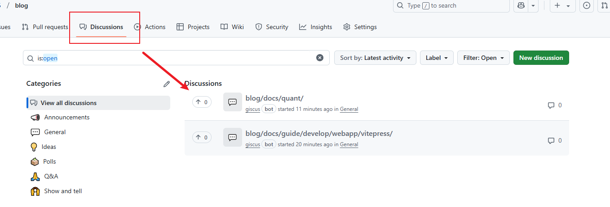

# 第三方插件

## Giscus评论

### GitHub安装Giscus组件

​	　首先，访问[这里](https://github.com/apps/giscus)对你的`GitHub`进行`giscus`的安装。点击右侧的`install`按钮进行安装即可，具体的流程页面如下：


​	　安装完成后，进入对应的仓库，点击`settings`，找到`Features`，勾选`Discussions` 以开启`Discussions`功能。

​	　然后，进入[Giscus配置页面](https://giscus.app/zh-CN)，**填写仓库** 并在 `Discussion分类`选择**General** 后，在`启用 giscus`就会生成一段`JS`代码。


### 安装Giscus插件

​	　在终端执行如下命令安装`giscus`插件。

```shell
npm install @giscus/vue
```

​	　在`.vitepress/theme/Layout.vue`中引入`<GisCus/>`并配上**上面的配置**即可。另外，此处还加了评论框暗黑和明亮主题切换的功能。

::: code-group

```vue[.vitepress/theme/Layout.vue]
<script setup lang="ts">
import {watch} from 'vue'
import GisCus from '@giscus/vue'
import DefaultTheme from 'vitepress/theme'
import {useRoute,useData,inBrowser} from 'vitepress'

const {page,isDark} = useData()
const {Layout} = DefaultTheme

// 评论框暗黑和明亮主题切换
watch(isDark, (dark) => {
    if (!inBrowser) return;
    const giscusWidget = document.querySelector('giscus-widget');
    if (!giscusWidget) return;
    const iframe = giscusWidget.shadowRoot?.querySelector('iframe');
    if (!iframe) return;
    iframe.contentWindow?.postMessage(
        {
            giscus: {
                setConfig: {
                    theme: dark ? 'dark' : 'light',
                },
            },
        },
        'https://giscus.app'
    );
});

</script>


<template>
  <Layout>
    <!-- #doc-after 这里使用了插槽，具体可见https://vitepress.dev/zh/guide/extending-default-theme#layout-slots -->
    <template #doc-after>
      <!--index页面不展示评论框 只有具体的文章才展示评论框 -->
      <div v-if="!page.filePath.includes('index.md')" style="margin-top: 24px">
        <GisCus
            :key="page.filePath"
            repo="请按需填写"
            repo-id="请按需填写"
            category-id="请按需填写"
            category="General"
            mapping="pathname"
            strict="0"
            reactions-enabled="1"
            emit-metadata="0"
            input-position="bottom"
            theme="preferred_color_scheme"
            lang="zh-CN"
            crossorigin="anonymous"
            Loading = 'lazy'/>
      </div>
    </template>
  </Layout>
</template>
```

:::

​	　重启博客后，即可在页面底部看到加载的评论区，使用`GitHub`登录即可评论，评论数据会被放入下面这个地方。




## 图片居中与放大

### 安装medium插件

​	　首先需要安装一下插件，`medium-zoom`插件可以实现图片的放大。

```shell
npm install medium-zoom
```

​	　然后，在`.vitepress/theme/index.js`中使用`mediumZoom`插件即可。

::: code-group

```js{3-5,10-24} [.vitepress/theme/index.js]
import DefaultTheme from 'vitepress/theme'
import './style/index.css'
import { onMounted, watch, nextTick } from "vue";
import { useRoute } from "vitepress";
import mediumZoom from "medium-zoom";

export default {
  extends: DefaultTheme,
  Layout: Layout,
  setup() {
    const route = useRoute();
    const initZoom = () => {
      // mediumZoom('[data-zoomable]', { background: 'var(--vp-c-bg)' }); // 默认
      // 不显式添加{data-zoomable}的情况下为所有图像启用此功能
      // mediumZoom(".main img", { background: "var(--vp-c-bg)" }); 
      // 使用 :not([alt="logo"]) 排除 alt="logo" 的图片
      mediumZoom(".main img:not([alt='logo'])", { background: "var(--vp-c-bg)" });
    };
    onMounted(() => {
      initZoom();
    });
    watch(
      () => route.path,
      () => nextTick(() => initZoom())
    );
  },
}
```

:::

​	　配置完成后，刷新页面，点击任意一个图片，即可看到效果。

### MarkDown样式

​	　添加**Markdown图片居中和放大**的`CSS`样式。

::: code-group

```vue [.vitepress/stycle/index.css]
<style>
    /* markdown图片居中 */
    .main img{
        display: block;
        margin: 0 auto;
    }
    
    /* markdown图片放大 */
    .medium-zoom-overlay {
        z-index: 30;
      }
    .medium-zoom-image {
      z-index: 9999 !important;
    }
</style>
```

:::

​	　配置完成后，刷新页面，点击任意一个图片，即可看到 效果。

## 视频播放

​	　Xgplayer更多配置，参加[这里](https://h5player.bytedance.com/config/#%E5%BF%85%E9%80%89%E9%85%8D%E7%BD%AE)。

### 添加Xgplayer组件

（1）安装

```shell
npm add -D xgplayer
```

（2）添加Xgplayer组件

::: details 组件详细代码

:::code-group

```vue [./vitepress/theme/components/Xgplayer.vue]
<template>
    <div id="mse"></div>
  </template>
  
  <script setup lang="ts">
  import Player from "xgplayer";
  import "xgplayer/dist/index.min.css";
  import { onMounted } from 'vue'
  
  interface propsType {
    url: string
    poster: string
  }
  
  const props = withDefaults(defineProps<propsType>(), {
    url: '',
    poster: '',
  })
  
  onMounted(() => {
    new Player({
      id: 'mse', //占位id
      volume: 0, // 默认静音
      lang: "zh", //设置中文
  
      autoplay: false, //关闭自动播放
      // autoplayMuted: true,// 是否开启自动静音
      fluid: true,  // 流式布局，自动宽高比
      controls: true, //开启控制栏，设为false即隐藏
      leavePlayerTime: 0, //鼠标离开控制栏隐藏延时时间，默认3000ms
      download: true, //开启下载
      keyShortcut: true, //开启热键
  
      url: props.url, //传入的url
      poster: props.poster, //传入的视频封面
  
      start: {
        isShowPause: true //暂停显示播放按钮
      }
  
    })
  
  })
  
  </script>
  
  <style scoped>
  #mse {
    flex: auto;
  }
  </style>
```


```js [.vitepress/theme/index.js]{1,8}
import Xgplayer from "./components/Xgplayer.vue"

export default {
  extends: DefaultTheme,
  Layout: Layout,
  enhanceApp: ({router,app}) =>{
    // 注册全局插件
    app.component("Xgplayer", Xgplayer);
  }
}
```

:::


### 本地测试

**输入：**

```
<Xgplayer url="http://vjs.zencdn.net/v/oceans.mp4" poster="/封面路径.png" />
```

**输出：**

<Xgplayer url="http://vjs.zencdn.net/v/oceans.mp4" poster="/封面路径.png" />

##  Sandpack

​	　Sandpack是一个实时编码插件，用法参加[这里](https://vitepress-sandbox.js-bridge.com/basic-usage/entry.html)。

### 安装sandpack

（1）安装命令

```shell
npm i vitepress-plugin-sandpack -D
```

> [!WARNING]
>
> 必须在`package.json`中增加`"type":"module"`

（2）注册为全局组件

::: code-group

```js[.vitepress/theme/index.js]
import Layout from './Layout.vue'
import { Sandbox } from 'vitepress-plugin-sandpack';// [!code ++]
import 'vitepress-plugin-sandpack/dist/style.css';// [!code ++]

export default {
  Layout,
  enhanceApp: ({router,app}) =>{
    // 将实时编码插件Sandbox注册为全局组件
    app.component('Sandbox', Sandbox); // [!code ++]
  },
}
```


```js[.vitepress/config.ts]
import { defineConfig } from 'vitepress'
import container from 'markdown-it-container'; // [!code ++]
import { renderSandbox } from 'vitepress-plugin-sandpack'; // [!code ++]

export default defineConfig({
  markdown: {
    config(md) { // [!code ++]
      md.use(container, 'sandbox', { // [!code ++] // [!code ++]
          render (tokens, idx) { // [!code ++]
            return renderSandbox(tokens, idx, 'sandbox'); // [!code ++]
          }, // [!code ++]
        }); // [!code ++]
    },// [!code ++]
  },
})

```

:::


### 本地测试

**输入：**

~~~vue
::: sandbox
```vue /src/App.vue [active]
<template>
  <div>{{ hello }}</div>
</template>

<script setup>
import { ref } from 'vue';

const hello = ref('Hello World!');
</script>
```

```js /src/main.js
import App from './App.vue';
import { createApp } from 'vue';

createApp(App).mount('#app');
```
:::
~~~

**输出：**

::: sandbox
```vue /src/App.vue [active]
<template>
  <div>{{ hello }}</div>
</template>

<script setup>
import { ref } from 'vue';

const hello = ref('Hello World!');
</script>
```

```js /src/main.js
import App from './App.vue';
import { createApp } from 'vue';

createApp(App).mount('#app');
```
:::

## 时间线

### 安装

​	　安装`vitepress-markdown-timeline`插件。

```sh
npm add -D vitepress-markdown-timeline
```

​	　引入插件中的样式并将插件配置到`markdown`配置项中。

::: code-group

```js[.vitepress/config.mts]
import timeline from "vitepress-markdown-timeline"; // [!code ++]

export default {
  markdown: { 
    //时间线
    config: (md) => {// [!code ++]
      md.use(timeline);// [!code ++]
    },// [!code ++]
  }, 
}
```


```js[.vitepress/theme/index.js]
// 只需添加以下一行代码，引入时间线样式
import "vitepress-markdown-timeline/dist/theme/index.css";
```

:::

### 本地测试

**输入：**

```
::: timeline 2023-04-24
- 一个非常棒的开源项目 H5-Dooring 目前 star 3.1k
  - 开源地址 https://github.com/MrXujiang/h5-Dooring
  - 基本介绍 http://h5.dooring.cn/doc/zh/guide/
- 《深入浅出webpack》 http://webpack.wuhaolin.cn/
:::

::: timeline 2023-04-23
:::
```
**输出：**

::: timeline 2023-04-24
- 一个非常棒的开源项目 H5-Dooring 目前 star 3.1k
  - 开源地址 https://github.com/MrXujiang/h5-Dooring
  - 基本介绍 http://h5.dooring.cn/doc/zh/guide/
- 《深入浅出webpack》 http://webpack.wuhaolin.cn/
:::

::: timeline 2023-04-23
:::

## 切换路由进度条

​	　安装一下插件：

```sh
pnpm add -D nprogress-v2
```

​	　配置如下代码生效：

::: code-group

```js[.vitepress/theme/index.js]
import DefaultTheme from 'vitepress/theme'
import Layout from './components/Layout.vue'
import { inBrowser } from "vitepress";// [!code ++]

// 进度条
import { NProgress } from 'nprogress-v2/dist/index.js'// [!code ++]
import 'nprogress-v2/dist/index.css'// [!code ++]

export default {
  extends: DefaultTheme,
  Layout: Layout,
  enhanceApp: ({router,app}) =>{
    // 切换路由进度条
    if (inBrowser) {// [!code ++]
      NProgress.configure({ showSpinner: false })// [!code ++]// [!code ++]
      router.onBeforeRouteChange = (to) => {// [!code ++]
        // 开始进度条
        NProgress.start()// [!code ++]
      }// [!code ++]
      // 停止进度条
      router.onAfterRouteChange = () => {// [!code ++]
         NProgress.done() // [!code ++]
       }// [!code ++]
    }// [!code ++]
  },
}
```

:::

## 五彩纸屑

​	　安装一下`canvas-confetti`插件：

```shell
npm install canvas-confetti
```

​	　只需将如下代码添加到首页`index.md`文章末尾即可，若想更换其他效果，可以参加[这里](https://www.kirilv.com/canvas-confetti/)预览。

::: code-group

```md [index.md]{7-11}
<!-- 添加到md文章末尾 -->
<script setup lang="ts">
    import confetti from "canvas-confetti";
    import { inBrowser } from "vitepress";
    if (inBrowser) {
      /* 纸屑 */
      confetti({
        particleCount: 100,
        spread: 170,
        origin: { y: 0.6 },
      });
    }
</script>
```

:::

## 附录

::: tip （1）为VitPress提供支持的插件

① Giscus评论插件

- 文档：[Giscus](https://giscus.app/zh-CN)文档
- 功能：为博客增加评论功能
- 安装命令：`npm install @giscus/vue`

② 五彩纸屑插件

- 安装命令：`npm install canvas-confetti`
- 预览：[实现效果](https://www.kirilv.com/canvas-confetti/)

③ Sandpack实时编码插件

- 安装命令：`npm i vitepress-plugin-sandpack -D`
- 文档：[sandpack文档](https://vitepress-sandbox.js-bridge.com/get-started/install.html)

④ Vue 组件预览插件

- 名称：`@vitepress-code-preview`

- 文档：[安装指南](https://welives.github.io/vitepress-code-preview/guide.html)

⑤ 根据目录自定生成侧边栏插件

- 名称：`vitepress-sidebar`
- 文档：[安装指南](https://vitepress-sidebar.cdget.com/guide/getting-started)

⑥ 页面加载进度插件

- 名称：`vitepress-plugin-nprogress`
- 文档：[安装指南](https://github.com/ZhongxuYang/vitepress-plugin-nprogress)

⑦ 文件图标插件

- 名称：`vitepress-plugin-group-icons`
- 文档：[安装指南](https://vp.yuy1n.io/features.html)

⑧ 博客访问流量统计分析工具

- 名称：`umami`
- 文档：[官网](https://umami.is)

⑨ 图片放大查看 

- 名称：`medium-zoom`
- 文档：[参见这里](https://github.com/vuejs/vitepress/issues/854)

⑩ 视频播放组件 Xgplayer

- 名称：`Xgplayer`
- 文档：[接入指南](https://h5player.bytedance.com/guide/#%E5%AE%89%E8%A3%85)


:::