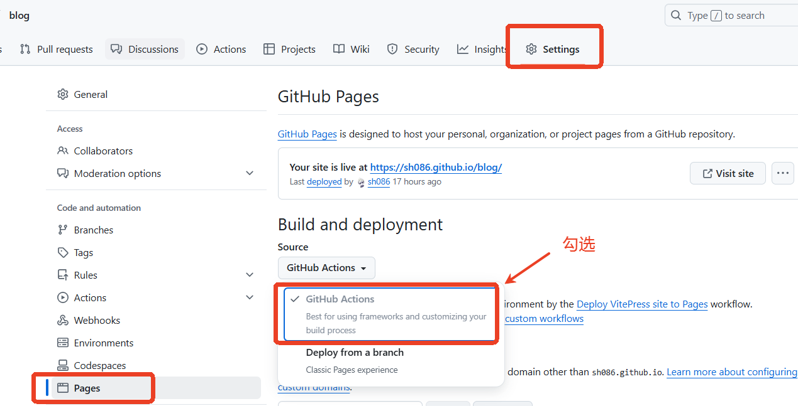
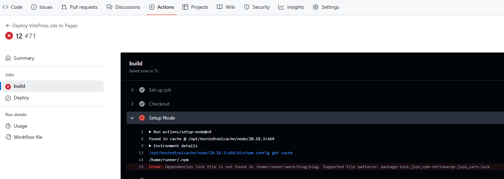
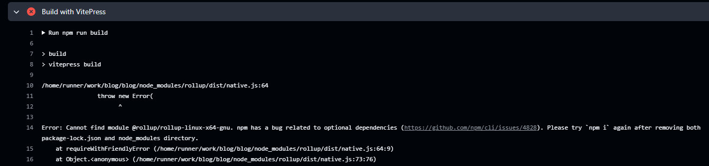

# 部署

> [参考](https://vitepress.dev/zh/guide/deploy)

## 本地构建测试

​	　在`config.mts`配置文件中配置`base`路径 以及 站点图标链接前加上仓库名。


```js
export default defineConfig({
  // 这里配置的是仓库名
  base: '/blog/',
   // 站点图标链接前加上仓库名
  head: [["link", { rel: "icon", href: "/blog/favicon.ico" }]],
})
```

​	　运行以下命令来构建文档：

```shell
npm run build
```

​	　构建文档后，通过运行以下命令可以在本地预览它：

```shell
npm run preview
```

​	　预览无误后，可继续部署到远程服务器上。

## GitHub Pages

### deploy.yml

​	　在项目的 `.github/workflows` 目录中创建一个名为 `deploy.yml` 的文件，其中包含这样的内容：

::: code-group

```yml[.github/workflows] {46-47,49,51,55}
# 构建 VitePress 站点并将其部署到 GitHub Pages 的示例工作流程
#
name: Deploy VitePress site to Pages

on:
  # 在针对 `main` 分支的推送上运行。如果你
  # 使用 `master` 分支作为默认分支，请将其更改为 `master`
  push:
    branches: [main]

  # 允许你从 Actions 选项卡手动运行此工作流程
  workflow_dispatch:

# 设置 GITHUB_TOKEN 的权限，以允许部署到 GitHub Pages
permissions:
  contents: read
  pages: write
  id-token: write

# 只允许同时进行一次部署，跳过正在运行和最新队列之间的运行队列
# 但是，不要取消正在进行的运行，因为我们希望允许这些生产部署完成
concurrency:
  group: pages
  cancel-in-progress: false

jobs:
  # 构建工作
  build:
    runs-on: ubuntu-latest
    steps:
      - name: Checkout
        uses: actions/checkout@v4
        with:
          fetch-depth: 0 # 如果未启用 lastUpdated，则不需要
      # - uses: pnpm/action-setup@v3 # 如果使用 pnpm，请取消此区域注释
      #   with:
      #     version: 9
      # - uses: oven-sh/setup-bun@v1 # 如果使用 Bun，请取消注释
      - name: Setup Node
        uses: actions/setup-node@v4
        with:
          node-version: 20
          cache: npm # 或 pnpm / yarn
      - name: Setup Pages
        uses: actions/configure-pages@v4
      - name: delete package-lock.json
        run: rm -rf package-lock.json
      - name: Install dependencies
        run: npm install # 或 pnpm install / yarn install / bun install
      - name: Build with VitePress
        run: npm run build # 或 pnpm docs:build / yarn docs:build / bun run docs:build
      - name: Upload artifact
        uses: actions/upload-pages-artifact@v3
        with:
          path: .vitepress/dist

  # 部署工作
  deploy:
    environment:
      name: github-pages
      url: ${{ steps.deployment.outputs.page_url }}
    needs: build
    runs-on: ubuntu-latest
    name: Deploy
    steps:
      - name: Deploy to GitHub Pages
        id: deployment
        uses: actions/deploy-pages@v4
```
:::

​	　因为`config.mts`中没有配`srcDir: './docs/'`这个属性的，所以，包构建成功后的位置是`.vitepress/dist`.但如果你有配置，这里需要改成`path: docs/.vitepress/dist`才行。

### Settings设置

​	　在仓库的`Settings`选择 `Pages` > `Build and deployment` > `GitHub Actions`，并将更改推送到 `main` 分支并等待 `GitHub Action` 工作流完成。



​	　等自动部署完成后，即可在 `https://<username>.github.io/[repository]/` 看到你的博客。而且你的站点将在每次推送到 `main` 分支时自动部署。


### 调试与分析

（1）改动点： 第49行

​	　由于前面改过`package.json`中的构建命令，所以应该改为`npm run build`。

（2）上面两个改动提交了后，`GitHub Action`报如下错误：



​	　本地运行`npm install`生成一个`package-lock.json`并上传到Git上，尝试修复一下此错误。注意，如果使用的是`yarn install`安装的依赖，需上传`yarn.lock`文件。

（3）上面的改动提交后，又提示如下错误：



​	　为解决上述问题，特做如下改动：

```
// 改动前
- name: Install dependencies
  run: npm ci # 或 pnpm install / yarn install / bun install

// 改动后
// 改动点：第46行 、第47行 和 第49行
- name: delete package-lock.json
  run: rm -rf package-lock.json  // 删除package-lock.json
- name: Install dependencies    
  run: npm install # 改为npm install，若使用npm ci会提示找不到package-lock.json的
```

​	　再次提交即可发现问题均已解决，可以正常部署了。

## SEO优化


https://blog.csdn.net/weixin_45732455/article/details/129975128

https://juejin.cn/post/7409865546197893171#heading-21


