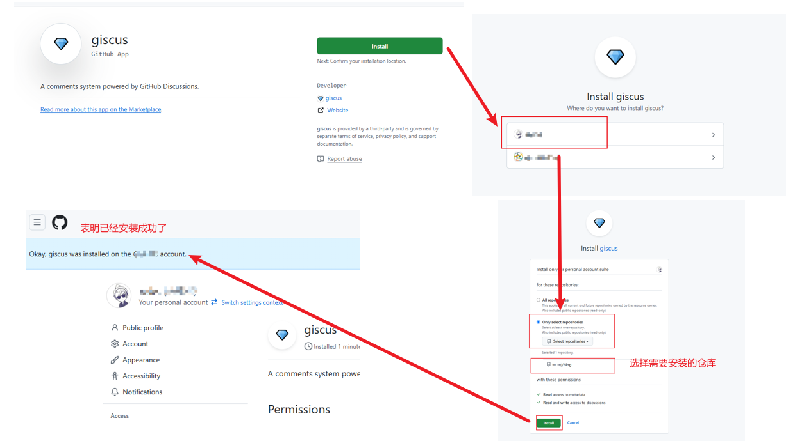

# Giscus评论

​	　首先，访问[这里](https://github.com/apps/giscus)对你的`GitHub`进行`giscus`的安装。点击右侧的`install`按钮进行安装即可，具体的流程页面如下：



​	　安装完成后，进入对应的仓库，点击`settings`，找到`Features`，勾选`Discussions` 以开启`Discussions`功能。然后，进入[Giscus配置页面](https://giscus.app/zh-CN)，**填写仓库** 并在 `Discussion分类`选择**General** 后，在`启用 giscus`就会生成一段`JS`代码。


​	　接着，在终端执行如下命令安装`giscus`插件。

```shell
npm install @giscus/vue
```

​	　最后，在`.vitepress/theme/Layout.vue`中引入`<GisCus/>`并配上**上面的配置**即可。另外，此处还加了评论框暗黑和明亮主题切换的功能。

::: code-group

```vue[.vitepress/theme/Layout.vue]
<script setup lang="ts">
import {watch} from 'vue'
import GisCus from '@giscus/vue'
import DefaultTheme from 'vitepress/theme'
import {useRoute,useData,inBrowser} from 'vitepress'

const {page,isDark} = useData()
const {Layout} = DefaultTheme

// 评论框暗黑和明亮主题切换
watch(isDark, (dark) => {
    if (!inBrowser) return;
    const giscusWidget = document.querySelector('giscus-widget');
    if (!giscusWidget) return;
    const iframe = giscusWidget.shadowRoot?.querySelector('iframe');
    if (!iframe) return;
    iframe.contentWindow?.postMessage(
        {
            giscus: {
                setConfig: {
                    theme: dark ? 'dark' : 'light',
                },
            },
        },
        'https://giscus.app'
    );
});

</script>

<template>
  <Layout>
    <!-- 这里使用了插槽，具体可见https://vitepress.dev/zh/guide/extending-default-theme#layout-slots -->
    <template #doc-after>
      <!--index页面不展示评论框 只有具体的文章才展示评论框 -->
      <div v-if="!page.filePath.includes('index.md')" style="margin-top: 24px">
        <GisCus
            :key="page.filePath"
            repo="sh086/blog"
            repo-id="R_kgDOJZ3-Ug"
            category="General"
            category-id="DIC_kwDOJZ3-Us4Cne5f"
            mapping="pathname"
            strict="0"
            reactions-enabled="1"
            emit-metadata="0"
            input-position="bottom"
            theme="preferred_color_scheme"
            lang="zh-CN"
            crossorigin="anonymous"
            />
      </div>
    </template>
  </Layout>
</template>

<style>
/* 
* 我是省略的style
 */
</style>
```

:::

​	　重启博客后，即可在页面底部看到加载的评论区，使用`GitHub`登录即可评论，评论数据会被放入下面这个地方。


