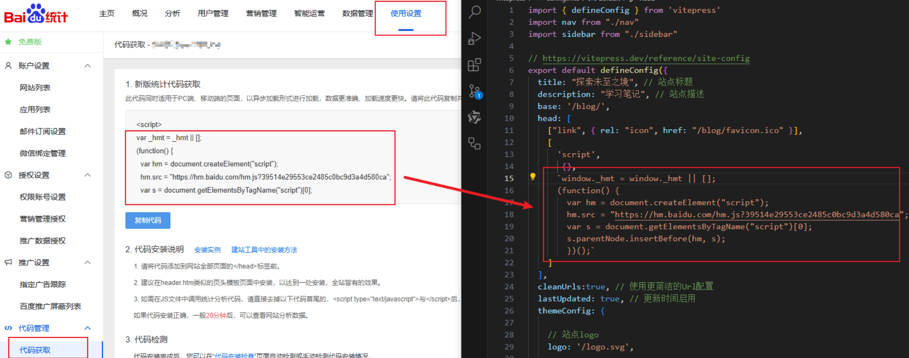
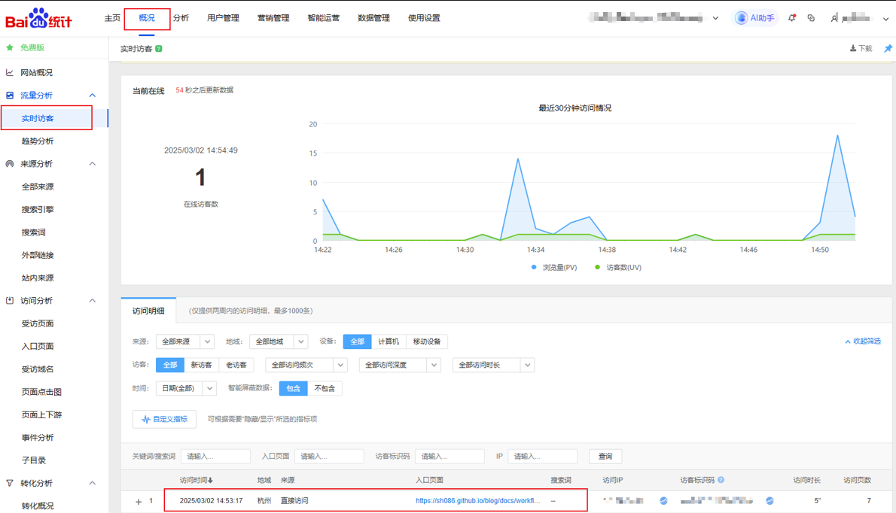
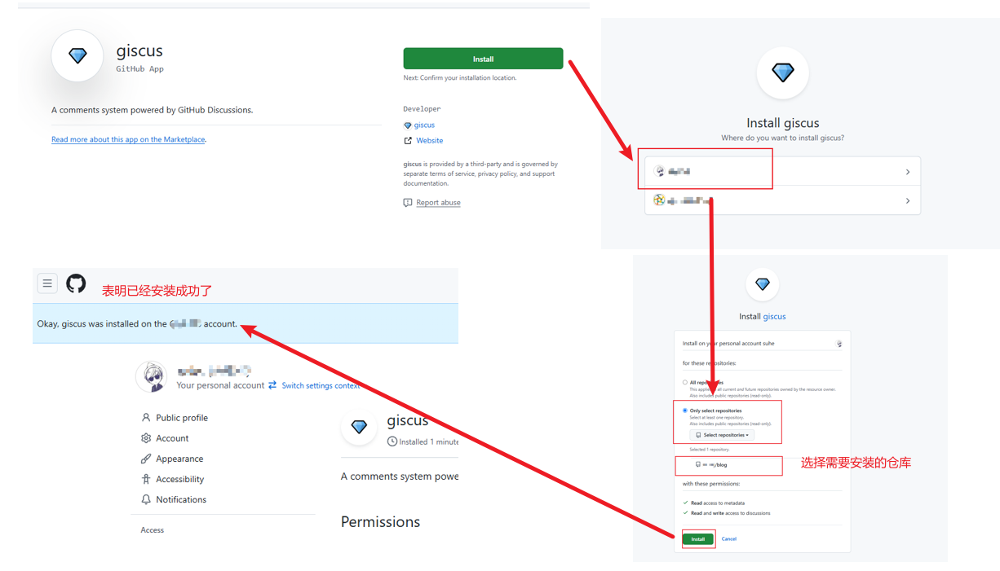
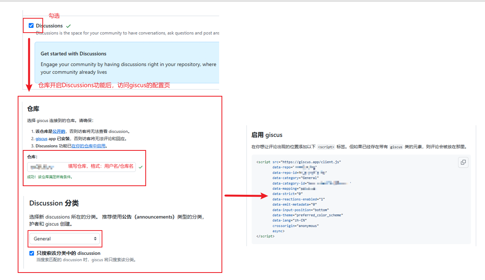
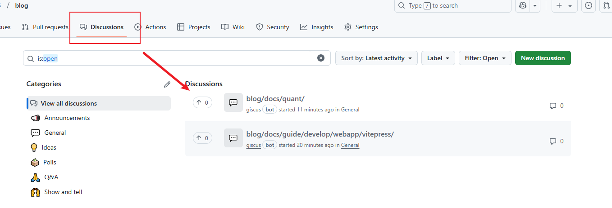

# 使用vitepress搭建在线博客


> [官网](https://vitepress.dev/zh/) | [视频教程](https://www.bilibili.com/video/BV1dfkvYBE4p/?spm_id_from=333.1387.collection.video_card.click) | [默认主题](https://vitepress.dev/zh/reference/default-theme-config)


## 快速开始

> [!WARNING] 前置准备
>
> [Node.js](https://nodejs.org/) 必须是`18`及以上版本

​	　新建`vitepress`文件夹，并在终端中运行`npm add -D vitepress`将VitePress 安装到当前目录。接着，运行`npx vitepress init`启动安装向导，所有选项**直接按回车选择默认的配置**。

```
┌  Welcome to VitePress!
│
◇  Where should VitePress initialize the config?
│  ./
│
◇  Site title:
│  My Awesome Project
│
◇  Site description:
│  A VitePress Site
│
◇  Theme:
│  Default Theme
│
◇  Use TypeScript for config and theme files?
│  Yes
│
◇  Add VitePress npm scripts to package.json?
│  Yes
│
└  Done! Now run npm run docs:dev and start writing.
```

​	　安装向导结束后，项目文件目录如下：

```
.
├─ .vitepress
│  │  └─ cache           # 开发缓存目录
│  │  └─ config.mts      # 配置文件
├─ api-examples.md
├─ markdown-examples.md
└─ index.md              # 主页
└─ package.json 
说明：配置文件后缀可能是 .mts 或 .js 或 .mjs 或 .ts
```

​	　最后，执行命令 `npm run docs:dev`启动项目，在终端即可看到站点的本地访问地址。

```
  ➜  Local:   http://localhost:5173/ # 这个就是站点的本地访问地址
  ➜  Network: use --host to expose
  ➜  press h to show help
```


## 站点

### 标题与描述

```js{2-3,5}
export default defineConfig({
  title: "My Awesome Project",     // 站点标题
  description: "A VitePress Site", // 站点描述
  themeConfig: {
    siteTitle: false,  // 是否展示站点标题
    
    // 以下配置仅用于移动端按钮中文化
    sidebarMenuLabel:"菜单",
    returnToTopLabel: "返回顶部",
    darkModeSwitchLabel: "深色模式",
    //用于自定义悬停时显示的深色模式开关标题
    darkModeSwitchTitle: "切换深色模式",
    //用于自定义悬停时显示的浅色模式开关标题
    lightModeSwitchTitle: "切换浅色模式",
  }
})
```


### 网站logo与图标

​	　在`.vitepress`同级目录下新增`public`目录，然后将`/favicon.ico`放到`public`目录中后，新增如下配置即可生效。若未能生效可清除`Cookie` 或 重启浏览器 再次尝试。另外，`logo`的配置同理。

```js{3,5}
export default defineConfig({
  // 设置网址图标
  head: [["link", { rel: "icon", href: "/favicon.ico" }]],
  themeConfig: {
    logo: '/logo.svg',  // 设置网址logo
})
```


### 使用更简洁的URL

​	　当设置为 `true` 时，VitePress 将从 URL 中删除 `.html` 后缀。

```js{4-8}
export default {
  cleanUrls:true, // 使用更简洁的Url配置
}
// 配置前:/markdown-examples.html
// 配置后:/markdown-examples
```


## 默认主题


### 目录索引

```js{3-4}
export default {
  themeConfig: {
    outlineTitle: "目录", // 定义索引的标题名称
    outline: [2,6], // 定义索引的标题级别
  }
}
```


### 上下页链接

```js{4-7}
export default {
  themeConfig: {
    // 上下页链接
    docFooter: {
      prev: '上一页',
      next: '下一页'
    }
  }
}
```


### 最后更新时间戳

​	　新增如下配置，即可在文章的末尾展示更新时间。注意，需有Git提交记录才能生效。

```js{3-9,12}
export default defineConfig({
    // 自定义上次更新的文本和日期格式
    lastUpdated: {
      text: '更新时间',
      formatOptions: {
        dateStyle: 'full',
        timeStyle: 'medium'
      }
    }
  },
   // 启用配置
  lastUpdated: true 
})
```


### 社交链接

```js{4-8}
export default defineConfig({
    // 社交链接
    // 可填入的icon有: gitlab、tiktok、twitter、wechat、qq、google、twitter等
    socialLinks: [
      { icon: 'bilibili', link: '...' },
      { icon: 'youtube', link: '...' },
      { icon: 'github', link: '...' },
    ],
  },
})
```


### 搜索

```js
export default {
  themeConfig: {
    // 设置搜索框的样式
    search: {
      provider: "local",
      options: {
        translations: {
          button: {
            buttonText: "搜索文档",
            buttonAriaLabel: "搜索文档",
          },
          modal: {
            noResultsText: "无法找到相关结果",
            resetButtonTitle: "清除查询条件",
            footer: {
              selectText: "选择",
              navigateText: "切换",
              closeText: "关闭",
            },
          },
        },
      },
    },
  }
}
```


### 页脚

​	　仅当页面不包含侧边栏时才会显示页脚，一般只能在主页显示。

```js{3-6}
export default {
  themeConfig: {
    footer: {
      message: 'Released under the MIT License.',
      copyright: 'Copyright © 2025-ME'
    }
  }
}
```


### 团队页


## 写作

### 导航栏

​	　首先，在`config.mts`同级目录下新建`nav.js`，并配置如下示例：

```js
export default [
  { text: '主页', link: '' },
  {
    text: '示例',
    items: [
      { text: 'markdown-examples', link: '/markdown-examples.md' },
      { text: 'api-examples', link: '/api-examples.md' },
    ]
  }
]
```

​	　然后在`config.mts`中引入`./nav`中的配置即可。

```js{1,5}
import nav from "./nav";

export default defineConfig({
  themeConfig: {
    nav: nav,
  },
})
```


### 侧边栏

（1）手动配置sidebar

​	　首先，在`config.mts`同级目录下新建`sidebar.js`，并配置如下示例：

```js
export default {
    '/': [
      {
        text: '示例',
        collapsed: false,
        items: [
          { text: 'markdown-example', link: '/markdown-examples.md'},
          { text: 'api-examples', link: '/api-examples.md'},
        ]
      },
    ],
}
```

​	　最后在`config.mts`中引入`./sidebar`中的配置即可。

```js{1,5}
import sidebar from "./sidebar"

export default defineConfig({
  themeConfig: {
    sidebar: sidebar,
  },
})
```


（2）自动配置sidebar
> [!WARNING] 警告
> 不建议自动配置sidebar


​	　首先，将[auto-gen-sidebar.mjs](./auto-gen-sidebar.mjs)放到在`config.mts`同级目录下，然后在`sidebar.js`新增如下配置：

```js
import { set_sidebar } from "./auto-gen-sidebar.mjs";
export default {
    // 第一个参数：常常是nav的link
    // 第二个参数：是相对于根路径的文件夹路径，返回的是每个文件夹中文件的名称和链接
    "/docs/": set_sidebar("/docs/")
}
```

​	　特别注意，自动配置`sidebar`**脚本生成的 访问路径 和 文件层级 是一样的**，所以，是**不能配置`srcDir: './docs'`的**。


### MarkDown

```js
export default {
  markdown: {
    lineNumbers: true, // 是否显示行号
    // 将自定义容器里面的提示信息变成中文
    // https://vitepress.dev/zh/guide/markdown#custom-containers
    container:{
      tipLabel:"提示",
      warningLabel:"警告",
      dangerLabel:"危险",
      infoLabel:"信息",
      detailsLabel:"详细信息",
    },
    image: {
      // 默认禁用；设置为 true 可为所有图片启用懒加载。
      lazyLoading: true
    }
  },
}
```


### frontmatter


## 自定义

### 嵌入视频样式

​	　首先，新建`.vitepress/theme/index.js`**主题入口文件**来启用自定义主题。然后，在同一目录下再新建`.vitepress/theme/Layout.vue`来开发自定义主题。文件目录如下：

```
.
├─ .vitepress
│  │  └─ cache           # 开发缓存目录
│  │  └─ config.mts      # 配置文件
│  │  └─ theme           # 自定义主题
│  │  │  └─ index.js     # 主题入口文件
│  │  │  └─ Layout.vue   # 组件
├─ public                # 静态资源
│  └─ favicon.ico        # 站点图标
│  └─ logo.svg           # 站点logo
├─ api-examples.md
├─ markdown-examples.md
└─ index.md              # 主页
└─ package.json
```

​	　当检测到存在主题入口文件``.vitepress/theme/index.js``时，VitePress 总会使用自定义主题而不是默认主题。

```js
// 可以直接在主题入口导入 Vue 文件
// VitePress 已预先配置 @vitejs/plugin-vue
import Layout from './Layout.vue'

export default {
  Layout,
  enhanceApp({ app, router, siteData }) {
    // ...
  }
}
```

​	　接着，在`Layout.vue`组件中将默认主题导入，并新增**嵌入视频的样式** 效果。

```vue
<script setup lang="ts">
import DefaultTheme from 'vitepress/theme'
const {Layout} = DefaultTheme
</script>

<template>
  <Layout></Layout>
</template>

<style>
    /* 
    * 修改嵌入视频的样式
    * 原来嵌入的视频特别小,样式修改后可以铺满整行
     */
    iframe {
      width: 100%;
      height: 400px;
      border-top-width: 0px;
      border-bottom-width: 0px;
      border-left-width: 0px;
      border-right-width: 0px;
      margin-top: 40px;
      margin-bottom: 40px;
    }
</style>
```

​	　完成后先重启项目，然后以B站视频为例，测试实现效果如下：


### 图片居中和放大

​	　`medium-zoom`插件可以实现图片的放大，首先需要安装一下插件。

```shell
npm install medium-zoom
```

​	　在`.vitepress/theme/Layout.vue`中添加**Markdown图片居中和放大**的`CSS`样式。

```vue
<style>
    /* markdown图片居中 */
    .main img{
        display: block;
        margin: 0 auto;
    }
    
    /* markdown图片放大 */
    .medium-zoom-overlay {
        z-index: 30;
      }
    .medium-zoom-image {
      z-index: 9999 !important;
    }
</style>
```

​	　然后，在`.vitepress/theme/index.js`中使用`mediumZoom`插件即可。

```js{2-4,8-20}
import Layout from './Layout.vue'
import mediumZoom from "medium-zoom";
import { onMounted, watch, nextTick } from "vue";
import { useRoute } from "vitepress";

export default {
  Layout,
  setup() {
    const route = useRoute();
    const initZoom = () => {
      // mediumZoom('[data-zoomable]', { background: 'var(--vp-c-bg)' }); // 默认
      // 不显式添加{data-zoomable}的情况下为所有图像启用此功能
      mediumZoom(".main img", { background: "var(--vp-c-bg)" }); 
    };
    onMounted(() => {
      initZoom();
    });
    watch(
      () => route.path,
      () => nextTick(() => initZoom())
    );
  },
}
```

​	　配置完成后，刷新页面，点击任意一个图片，即可看到效果。

### 更改搜索位置

### 在MarkDown使用Vue

​	　我们以实现在**主页展示五彩纸屑**这个功能来讲述如何在在`MarkDown`使用`Vue`，点击[这里](https://www.kirilv.com/canvas-confetti/)预览效果。首先，需要安装一下插件。

```shell
npm install canvas-confetti
```

（1）实现方式一：直接开发

​	　在`index.md`文章尾部直接使用即可，然后重启项目，刷新首页即可看到效果啦。

```vue
<!-- 添加到md文章末尾 -->
<script setup lang="ts">
    import confetti from "canvas-confetti";
    import { inBrowser } from "vitepress";
    if (inBrowser) {
      /* 纸屑 */
      confetti({
        particleCount: 100,
        spread: 170,
        origin: { y: 0.6 },
      });
    }
</script>
```

（2）实现方式二：导入组件

​	　新建`.vitepress/theme/confetti.vue`，具体内容如下：

```vue
<!-- .vitepress/theme/confetti.vue -->
<script setup lang="ts">
import confetti from "canvas-confetti";
import { inBrowser } from "vitepress";

if (inBrowser) {
  /* 纸屑 */
  /* 可以在下面的网站选择其他的效果，只需更换一下这里的代码即可 */
  /* https://www.kirilv.com/canvas-confetti/ */
  confetti({
    particleCount: 100,
    spread: 170,
    origin: { y: 0.6 },
  });
}
</script>
<!-- 这种方法必须要template，否则报错 -->
<template></template>
```

​	　在`index.md`中先导入`confetti`组件，然后在md文章末尾使用即可。

```vue
<script setup lang="ts">
    import confetti from ".vitepress/theme/confetti.vue";
</script>

<!-- 添加到md文章末尾 -->
<confetti/>
```

（3）实现方式三：全局导入

​	　在`.vitepress/theme/index.ts`注入该 Vue 组件。

```js
import confetti from "./confetti.vue";

export default {
  Layout,
  enhanceApp: ({router,app}) =>{
    // 注册五彩纸屑插件
    app.component("confetti", confetti);
  }
}
```

​	　在`index.md`文章尾部直接使用即可，然后重启项目，刷新首页即可看到效果啦。

```vue
<script setup lang="ts">
    import confetti from "canvas-confetti";
    import { inBrowser } from "vitepress";
    if (inBrowser) {
      /* 纸屑 */
      confetti({
        particleCount: 100,
        spread: 170,
        origin: { y: 0.6 },
      });
    }
</script>
```


### 百度统计文章浏览量

​	　访问[百度统计](https://tongji.baidu.com/web5/10000673844/welcome/login)并登录，点击 `进入产品` -> `使用设置` ->`新增网站`，按要求填写后，即可在 `代码管理` - > `代码获取` 中获得所需的统计代码，然后将其复制并粘贴到您要跟踪的网页中。



​	　由于`VitePress`是静态页面，在切换页面的时候不会触发请求，所以需要在**进入网站时就把这段脚本加上**，而且在**切换页面的时候也需要触发统计**。注意，这里要将`var _hmt=._hmt || []` 改为 `window._hmt=window._hmt || []` 否则会在`console`提示错误。

```js{3-13}
head: [
    ["link", { rel: "icon", href: "/blog/favicon.ico" }],
    [
      'script',
       {},
      `window._hmt = window._hmt || [];
      (function() { 
        var hm = document.createElement("script"); 
        hm.src = "https://hm.baidu.com/hm.js?39514e29553ce2485c0bc9d3a4d580ca";
        var s = document.getElementsByTagName("script")[0]; 
        s.parentNode.insertBefore(hm, s);
        })();`
    ]
  ],
```

​	　然后，在 `.vitepress/theme/index.js`中配置**线上环境在切换路径时将访问记录自动申报到百度统计**。

```js{5-13}
// .vitepress/theme/index.js
import Layout from './Layout.vue'

export default {
  Layout,
  enhanceApp: ({router}) =>{
    // 只允许线上环境在切换路径时将访问记录自动申报到百度统计
    router.onBeforeRouteChange = (to) => {
      if(import.meta.env.MODE === 'production') {
        if( typeof _hmt !== 'undefined' && !!to ){
          _hmt.push(['_trackPageview', to])
        }
      }
    };
  }
}
```

​	　配置完成后，即可在实时访客页面看到对应的统计信息。PS:这里统计结果的显示是有延迟的。




### 文章归类


### Giscus评论

​	　首先，访问[这里](https://github.com/apps/giscus)对你的`GitHub`进行`giscus`的安装。点击右侧的`install`按钮进行安装即可，具体的流程页面如下：



​	　安装完成后，进入对应的仓库，点击`settings`，找到`Features`，勾选`Discussions` 以开启`Discussions`功能。然后，进入[Giscus配置页面](https://giscus.app/zh-CN)，**填写仓库** 并在 `Discussion分类`选择**General** 后，在`启用 giscus`就会生成一段`JS`代码。



​	　接着，在终端执行如下命令安装`giscus`插件。

```shell
npm install @giscus/vue
```

​	　最后，在`.vitepress/theme/Layout.vue`中引入`<GisCus/>`并配上**上面的配置**即可。另外，此处还加了评论框暗黑和明亮主题切换的功能。

```vue
<script setup lang="ts">
import {watch} from 'vue'
import GisCus from '@giscus/vue'
import DefaultTheme from 'vitepress/theme'
import {useRoute,useData,inBrowser} from 'vitepress'

const {page,isDark} = useData()
const {Layout} = DefaultTheme

// 评论框暗黑和明亮主题切换
watch(isDark, (dark) => {
    if (!inBrowser) return;
    const giscusWidget = document.querySelector('giscus-widget');
    if (!giscusWidget) return;
    const iframe = giscusWidget.shadowRoot?.querySelector('iframe');
    if (!iframe) return;
    iframe.contentWindow?.postMessage(
        {
            giscus: {
                setConfig: {
                    theme: dark ? 'dark' : 'light',
                },
            },
        },
        'https://giscus.app'
    );
});

</script>

<template>
  <Layout>
    <!-- 这里使用了插槽，具体可见https://vitepress.dev/zh/guide/extending-default-theme#layout-slots -->
    <template #doc-after>
      <!--index页面不展示评论框 只有具体的文章才展示评论框 -->
      <div v-if="!page.filePath.includes('index.md')" style="margin-top: 24px">
        <GisCus
            :key="page.filePath"
            repo="sh086/blog"
            repo-id="R_kgDOJZ3-Ug"
            category="General"
            category-id="DIC_kwDOJZ3-Us4Cne5f"
            mapping="pathname"
            strict="0"
            reactions-enabled="1"
            emit-metadata="0"
            input-position="bottom"
            theme="preferred_color_scheme"
            lang="zh-CN"
            crossorigin="anonymous"
            Loading = 'lazy'/>
      </div>
    </template>
  </Layout>
</template>

<style>
/* 
* 我是省略的style
 */
</style>
```

​	　重启博客后，即可在页面底部看到加载的评论区，使用`GitHub`登录即可评论，评论数据会被放入下面这个地方。




### 公益404页面

​	　首先，新建`.vitepress/theme/NotFound.vue`，详细如下：

```vue
<template>
    <div id="404-container">
      <!-- 腾讯404公益页面将被动态加载到这里 -->
    </div>
  </template>
  
  <script setup lang="ts">
  import { onMounted } from 'vue'
  
  onMounted(() => {
    const script = document.createElement('script')
    script.type = 'text/javascript'
    script.src = 'https://volunteer.cdn-go.cn/404/latest/404.js'
    document.getElementById('404-container')?.appendChild(script)
  })
  </script>
  
  <style scoped>
  #404-container {
    display: flex;
    justify-content: center;
    align-items: center;
    height: 100vh;
  }
  </style>
```

​	　然后，将`NotFound.vue`引入到`.vitepress/theme/Layout.vue`使用即可。

```vue
<script setup lang="ts">
import NotFound from './NotFound.vue'
</script>

<template>
  <Layout>
    <!-- #not-found 这里使用了插槽-->
    <!-- 具体可见https://vitepress.dev/zh/guide/extending-default-theme#layout-slots-->
    <template #not-found>
      <NotFound></NotFound>
    </template>
  </Layout>
</template>
```


## 部署

### GitHub Pages

​	　在项目的 `.github/workflows` 目录中创建一个名为 `deploy.yml` 的文件，其中包含这样的内容：

```yml{53}
# 构建 VitePress 站点并将其部署到 GitHub Pages 的示例工作流程
#
name: Deploy VitePress site to Pages

on:
  # 在针对 `main` 分支的推送上运行。如果你
  # 使用 `master` 分支作为默认分支，请将其更改为 `master`
  push:
    branches: [main]

  # 允许你从 Actions 选项卡手动运行此工作流程
  workflow_dispatch:

# 设置 GITHUB_TOKEN 的权限，以允许部署到 GitHub Pages
permissions:
  contents: read
  pages: write
  id-token: write

# 只允许同时进行一次部署，跳过正在运行和最新队列之间的运行队列
# 但是，不要取消正在进行的运行，因为我们希望允许这些生产部署完成
concurrency:
  group: pages
  cancel-in-progress: false

jobs:
  # 构建工作
  build:
    runs-on: ubuntu-latest
    steps:
      - name: Checkout
        uses: actions/checkout@v4
        with:
          fetch-depth: 0 # 如果未启用 lastUpdated，则不需要
      # - uses: pnpm/action-setup@v3 # 如果使用 pnpm，请取消此区域注释
      #   with:
      #     version: 9
      # - uses: oven-sh/setup-bun@v1 # 如果使用 Bun，请取消注释
      - name: Setup Node
        uses: actions/setup-node@v4
        with:
          node-version: 20
          cache: npm # 或 pnpm / yarn
      - name: Setup Pages
        uses: actions/configure-pages@v4
      - name: Install dependencies
        run: npm ci # 或 pnpm install / yarn install / bun install
      - name: Build with VitePress
        run: npm run docs:build # 或 pnpm docs:build / yarn docs:build / bun run docs:build
      - name: Upload artifact
        uses: actions/upload-pages-artifact@v3
        with:
          path: .vitepress/dist

  # 部署工作
  deploy:
    environment:
      name: github-pages
      url: ${{ steps.deployment.outputs.page_url }}
    needs: build
    runs-on: ubuntu-latest
    name: Deploy
    steps:
      - name: Deploy to GitHub Pages
        id: deployment
        uses: actions/deploy-pages@v4
```

​	　这里特别需要注意`第53行`，我这里没有配送`srcDir: './docs/'`这个属性的，如果你有配置，这里需要改成`path: docs/.vitepress/dist`才行。

​	　然后，在`config.mts`配置文件中配置`base`路径 以及 站点图标链接前加上仓库名。

```
export default defineConfig({
  // 这里配置的是仓库名
  base: '/vitepress/',
   // 站点图标链接前加上仓库名
  head: [["link", { rel: "icon", href: "/vitepress/favicon.ico" }]],
})
```

​	　接着，在仓库的`Settings`选择`Build and deployment` > `Source` > `GitHub Actions`，并将更改推送到 `main` 分支并等待 `GitHub Action` 工作流完成。

​	　注意，如果使用的是`npm install`安装的依赖，还需上传`package-lock.json`；如果使用的是`yarn install`安装的依赖，则还需上传`yarn.lock`文件。

​	　等自动部署完成后，即可在 `https://<username>.github.io/[repository]/` 看到你的博客。而且你的站点将在每次推送到 `main` 分支时自动部署。


### SEO优化


https://blog.csdn.net/weixin_45732455/article/details/129975128

https://juejin.cn/post/7409865546197893171#heading-21
