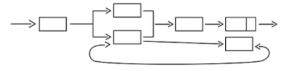

# 2021年下半年真题

## 综合知识

1、“十四五”期间，我国关注推动政务**信息化**共建共用，推动构建网络安全空间命运共同体，属于____建设内容。

A.科技中国

B.数字中国

C.制造中国

D.创新中国

::: details 参考答案

B
详解：信息化就是数字化的意思

:::

2、____关注的是业务：以业务驱动技术，强调IT与业务的对齐，以开放标准**封装**业务流程和已有的应用系统，实现应用系统之间的相互访问。

A.面向过程方法

B.面向对象方法

C.面向构件方法

D.面向服务方法

::: details 参考答案

B

:::

3、____是一种新型的计算机模式，其核心在于对**开放网络环境下的大规模互联网用户群体资源进行有效管理和系统利用**，以实现智能最大化。

A.群智协同计算

B.边缘计算

C.泛在计算

D.量子协同计算

::: details 参考答案

A

:::

4、在可用性和可靠性规划与设计中，需要引入特定的方法来提高系统的的可用性，其中把**可能出错的组件**从服务中删除属于策略。

A.错误检测

B.错误恢复

C.错误预防

D.错误清除

::: details 参考答案

C

:::

5、2021年9月1日起施行《关键信息基础设施安全保护条例》（中华人民共和国国务院令第745号）规定运营者应当自行或委托网络安全服务机构对关键信息基础设施网络安全检测和风险评估。

A.每两年至少进行一次

B.每年进行一次

C.每半年至少进行一次

D.每季度至少进行一次

::: details 参考答案

B

:::

6、当前人工智能细分领域涌现出大批专业型深度学习架构，其中____擅长自然语言处理。

A.ROS

B.OpenCV

C.NLTK

D.ARTOOIKit

::: details 参考答案

C
详解：NLTK是Natural Language Toolkit的简称

:::

7、数据分析师在数据治理、____阶段，对业务进行分析，并应用业务据点的方法，分析并获取所需要的数据。

A.数据存储于管理

B.数据应用

C数据脱敏

D.数据规划

::: details 参考答案

D

:::

8、国务院国资委办公厅2020年8月发布的《关于加快推进国有企业数字化转型工作的通知》中提出四个转型的方向，其中“探索平台化，集成化，场景化增值服务”属于推进____的内容。

A.产品创新数字化

B.生产运营智能化

C.用户服务敏捷化

D.产业体系生态化

::: details 参考答案

C

:::

9、图中的软件架构设计属于

A.虚拟机风格

B.调用返回风格

C独立构件风格

D.数据流风格

::: details 参考答案

D

:::

10、CMMI的**项目管理类**过程域不包含

A.配置管理

B.量化项目管理

C.项目监督与控制

D.风险管理

::: details 参考答案

A
详解：配置管理属于支持类

:::

11、主流的软件开发工具(IDE)均提供一些稿件，用来进行代码的静态检查,帮助开发人员做出质量高的软件，这种稿件所进行的测试不属于

A.静态测试

B.盲盒

C.代码走查

D.功能测试

::: details 参考答案

B

详解：没有盲盒，应该是白盒测试

:::

https://www.bilibili.com/video/BV193wXeAEbT/?spm_id_from=333.337.search-card.all.click&vd_source=f87f39b1af12eeb6301c7d9944f97ec9