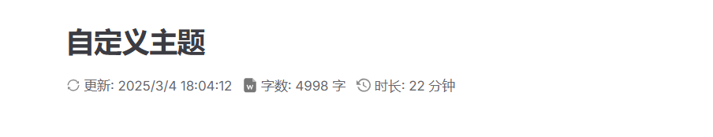
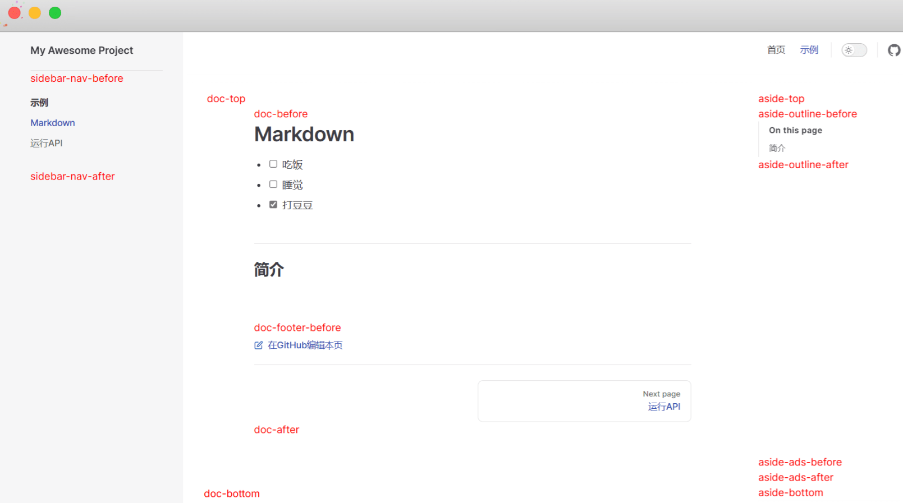
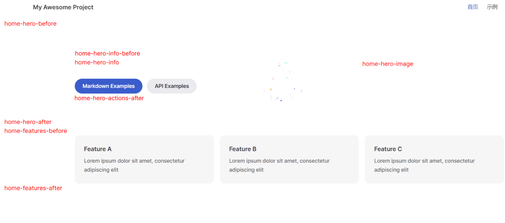
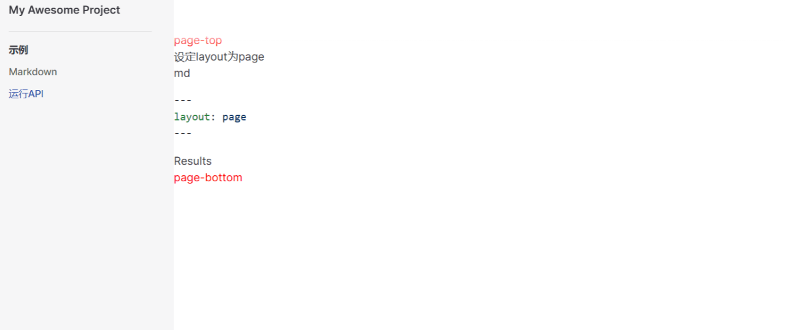
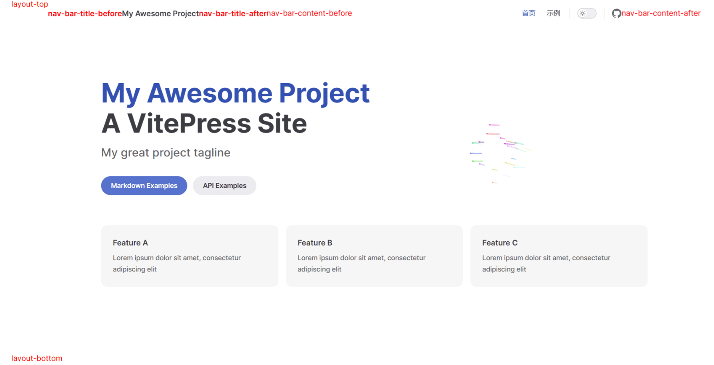

# 自定义主题

## 简介

​	　新建`.vitepress/theme/index.js`**主题入口文件**来启用自定义主题，当检测到存在主题入口文件时，**VitePress 总会使用自定义主题而不是默认主题**。

```sh
.
├─ .vitepress
│  │  └─ cache                 # 开发缓存目录
│  │  └─ config.mts            # 配置文件
│  │  └─ theme                 # 自定义主题 [!code ++]
│  │  │  └─ index.js           # 主题入口文件 [!code ++]
│  │  │  └─ utils              # 工具[!code ++]
│  │  │  └─ components         # 自定义组件[!code ++]
│  │  │  │  └─ Layout.vue      # 自定义布局组件[!code ++]
│  │  │  └─ stycle             # 自定义样式[!code ++]
│  │  │  │  └─ index.css       # 入口样式[!code ++]
│  │  └─ config.mts            # 配置文件[!code ++]
├─ public                      # 静态资源
│  └─ favicon.ico              # 站点图标
│  └─ logo.svg                 # 站点logo
└─ index.md                    # 主页
└─ package.json
```

​	　在`.vitepress/theme/index.js`**主题入口文件**中输入如下代码，即可实现在默认主题上进行自定义扩展了。

```js
// 可以直接在主题入口导入 Vue 文件
// VitePress 已预先配置 @vitejs/plugin-vue
import DefaultTheme from 'vitepress/theme'
// 导出默认主题
export default DefaultTheme
```

​	　预告：自定义样式只需导入`CSS`文件即可，自定义组件的方式有注册为**全局组件**、**使用Layout布局插**、**使用h函数**三种，大致方式如下：

```js
// 导入默认组件
import DefaultTheme from 'vitepress/theme' // [!code ++]
// 导入h函数，与 自定义组件注册方式三：使用布局插槽 -- h函数实现 同步使用
import { h } from 'vue'// [!code ++]
// 导入自定义组件
import 组件 from "./components/组件.vue"// [!code ++]
// 用于自定义样式
import './style/index.css'// [!code ++]

export default {
  // 在默认主题上拓展
  extends: DefaultTheme,// [!code ++]
  
  // 自定义组件注册方式一：注册为全局组件
  enhanceApp: ({router,app}) =>{
    // 注册为全局组件
    app.component('组件名', 组件);// [!code ++]
  }
  
  // 自定义组件注册方式二：使用布局插槽 -- Layout实现(与h函数实现方式不能共用)
  // 后续将这个Layout如何实现
  Layout: Layout,// [!code ++]
  
  // 自定义组件注册方式三：使用布局插槽 -- h函数实现(与Layout函数实现方式不能共用)
  Layout() { // [!code ++]
    return h(DefaultTheme.Layout, null, {// [!code ++]// [!code ++]
      'doc-footer-before': () => h(组件),// [!code ++]
    })// [!code ++]
  },// [!code ++]
}
```


## 自定义样式

### 嵌入视频样式

​	　首先，在`index.css`中定义`iframe`的新样式，然后在主题入口文件`index.js`中引用即可。

::: code-group

```css[.vitepress/stycle/index.css]
/* 
* 修改嵌入视频的样式
* 原来嵌入的视频特别小,样式修改后可以铺满整行
*/
iframe {
    width: 100%;
    height: 400px;
    border-top-width: 0px;
    border-bottom-width: 0px;
    border-left-width: 0px;
    border-right-width: 0px;
    margin-top: 40px;
    margin-bottom: 40px;
}
```


```js [.vitepress/theme/index.js]
import DefaultTheme from 'vitepress/theme'
import './stycle/index.css'  // [!code ++]

// 导出默认主题
export default DefaultTheme
```

:::

以B站视频为例，测试实现效果如下：


### 更多的样式美化

::: code-group

```css[.vitepress/stycle/index.css]
/* 表格宽度自适应 */
th, td{
  /* // 不让th td内容换行显示 */
    white-space: nowrap !important; 
    /* // 强制均匀分配宽度 */
    width: 1%; 
}
```

:::

## 自定义组件

### 链接卡片

::: details 组件详细代码

::: code-group

```js [.vitepress/theme/index.js]
import DefaultTheme from 'vitepress/theme'
import Linkcard from './components/Linkcard.vue'//[!code ++]

export default {
  extends: DefaultTheme,
  enhanceApp({ app }) {
    // 注册自定义全局组件
    app.component('Linkcard',Linkcard) //[!code ++]
  }
}
```

```vue [./vitepress/theme/components/Linkcard.vue]
<script setup lang="ts">
interface Props {
    url: string
    title: string
    logo: string
    description?: string
    type?: string // 默认：normal 可选 normal、full
}

const props = withDefaults(defineProps<Props>(), {
    url: '',
    title: '',
    description: '',
    logo: '',
    type: 'normal',
})
</script>

<template>
    <div v-if="props.type === 'normal'" style="margin-top: 24px" class="linkcard">
        <a :href="props.url" >
            <div class="logo">
                
            </div>
            <p class="description">{{ props.title }}</p>
        </a>
    </div>

    <div v-if="props.type === 'full'" style="margin-top: 24px" class="linkcard_large">
        <a :href="props.url">
            <p class="description">{{ props.title }}<br><span>{{ props.description }}</span></p>
            <div class="logo">
                
            </div>
        </a>
    </div>
</template>

<style>
/* 卡片背景 */
.linkcard {
    background-color: var(--vp-c-bg-soft);
    border-radius: 8px;
    padding: 8px;
    transition: color 0.5s, background-color 0.5s;
    margin: 15px 0 0 15px; /* 添加外边距以便在一行中排列 */
    width: 120px; /* 设置固定宽度 */
    height: 120px; /* 设置固定高度，使其成为正方形 */
    display: inline-block; /* 或者使用 flex */
    vertical-align: top; /* 确保垂直对齐 */
    box-sizing: border-box; /* 确保内边距和边框包含在宽度内 */
}


/* 卡片鼠标悬停 */
.linkcard:hover {
    background-color: var(--vp-c-yellow-soft);
}


/* 链接样式 */
.linkcard a {
    display: flex;
    flex-direction: column;
    align-items: center;
    justify-content: center;
    height: 100%;
    width: 100%;
    text-decoration: none;
    color: inherit;
}

/* 描述链接文字 */
.linkcard .description {
    flex: 1;
    font-weight: 500;
    font-size: 16px;
    line-height: 25px;
    color: var(--vp-c-text-1);
    margin: 0;
    text-align: center;
    transition: color 0.5s;
    display: flex;
    align-items: center;
    justify-content: center; 
    height: 100%; 
    width: 100%;
}

/* 卡片背景 */
.linkcard_large {
    background-color: var(--vp-c-bg-soft);
    border-radius: 8px;
    padding: 8px 16px 8px 8px;
    transition: color 0.5s, background-color 0.5s;
    margin-top: 15px;
}

/* 卡片鼠标悬停 */
.linkcard_large:hover {
    background-color: var(--vp-c-yellow-soft);
}

/* 链接样式 */
.linkcard_large a {
    display: flex;
    align-items: center;
}

/* 描述链接文字 */
.linkcard_large .description {
    flex: 1;
    font-weight: 500;
    font-size: 16px;
    line-height: 25px;
    color: var(--vp-c-text-1);
    margin: 0 0 0 16px;
    transition: color 0.5s;
}

/* 描述链接文字2 */
.linkcard_large .description span {
    font-size: 14px;
}

/* 链接下划线去除 */
.vp-doc a {
    text-decoration: none;
}

/* logo图片 */
.logo img {
    width: 80px;
    object-fit: contain;
    cursor: default; 
}
</style>
```

:::

**输入：**

```vue
<Linkcard 
  url="https://vitepress.yiov.top/" 
  title="Vite1" 
  logo="https://vitepress.yiov.top/logo.png"
  />

<Linkcard 
  url="https://vitepress.yiov.top/" 
  title="Vite2" 
  logo="https://vitepress.yiov.top/logo.png"
  />

<Linkcard 
  url="https://vitepress.yiov.top/" 
  title="Vite3" 
  logo="https://vitepress.yiov.top/logo.png"
  />

<Linkcard 
  url="https://vitepress.yiov.top/" 
  title="WebApp" 
  description="https://vitepress.yiov.top/" 
  logo="https://vitepress.yiov.top/logo.png"
  type="full"
  />
```

**输出：**

<Linkcard 
  url="https://vitepress.yiov.top/" 
  title="Vite1" 
  logo="https://vitepress.yiov.top/logo.png"
  />

<Linkcard 
  url="https://vitepress.yiov.top/" 
  title="Vite2" 
  logo="https://vitepress.yiov.top/logo.png"
  />

<Linkcard 
  url="https://vitepress.yiov.top/" 
  title="Vite3" 
  logo="https://vitepress.yiov.top/logo.png"
  />

<Linkcard 
  url="https://vitepress.yiov.top/" 
  title="WebApp" 
  description="https://vitepress.yiov.top/" 
  logo="https://vitepress.yiov.top/logo.png"
  type="full"
  />


### 文章标题信息

::: details 组件详细代码

::: code-group

```js [index.js]
import DefaultTheme from 'vitepress/theme'
import ArticleMetadata from './components/ArticleMetadata.vue'//[!code ++]

export default {
  extends: DefaultTheme,
  enhanceApp({ app }) {
    // 注册自定义全局组件
    app.component('ArticleMetadata',ArticleMetadata)//[!code ++]
  }
}
```

```vue[ArticleMetadata.vue]
<script lang="ts" setup>
import { useData } from 'vitepress'
import { computed, ref, onMounted } from 'vue'
import { countWord } from '../utils/functions'

const { page } = useData()
const date = computed(
  () => new Date(page.value.lastUpdated!)
)

const wordCount = ref(0)
const imageCount = ref(0)

const wordTime = computed(() => {
    return ((wordCount.value / 275) * 60)
})

const imageTime = computed(() => {
    const n = imageCount.value
    if (imageCount.value <= 10) {
        // 等差数列求和
        return n * 13 + (n * (n - 1)) / 2
    }
    return 175 + (n - 10) * 3
})

// 阅读时间
const readTime = computed(() => {
    return Math.ceil((wordTime.value + imageTime.value) / 60)
})


function analyze() {
    document.querySelectorAll('.meta-des').forEach(v => v.remove())
    const docDomContainer = window.document.querySelector('#VPContent')
    const imgs = docDomContainer?.querySelectorAll<HTMLImageElement>(
        '.content-container .main img'
    )
    imageCount.value = imgs?.length || 0
    const words = docDomContainer?.querySelector('.content-container .main')?.textContent || ''
    wordCount.value = countWord(words)
}

onMounted(() => {
    // 初始化时执行一次
    analyze()
})
</script>


<template>
    <div class="word">
        <p>
            <svg t="1724572866572" class="icon" viewBox="0 0 1024 1024" version="1.1" xmlns="http://www.w3.org/2000/svg" p-id="18131" width="16" height="16"><path d="M168.021333 504.192A343.253333 343.253333 0 0 1 268.629333 268.8a342.229333 342.229333 0 0 1 243.285334-100.778667A341.504 341.504 0 0 1 755.029333 268.8c9.856 9.898667 19.2 20.394667 27.733334 31.402667l-60.16 46.976a8.021333 8.021333 0 0 0 2.986666 14.122666l175.701334 43.008a8.021333 8.021333 0 0 0 9.898666-7.68l0.810667-180.906666a7.936 7.936 0 0 0-12.885333-6.314667L842.666667 253.44a418.858667 418.858667 0 0 0-330.922667-161.493333c-229.12 0-415.488 183.594667-419.797333 411.818666a8.021333 8.021333 0 0 0 8.021333 8.192H160a7.978667 7.978667 0 0 0 8.021333-7.808zM923.946667 512H864a7.978667 7.978667 0 0 0-8.021333 7.808 341.632 341.632 0 0 1-26.88 125.994667 342.186667 342.186667 0 0 1-73.685334 109.397333 342.442667 342.442667 0 0 1-243.328 100.821333 342.229333 342.229333 0 0 1-270.976-132.224l60.16-46.976a8.021333 8.021333 0 0 0-2.986666-14.122666l-175.701334-43.008a8.021333 8.021333 0 0 0-9.898666 7.68l-0.682667 181.034666c0 6.698667 7.68 10.496 12.885333 6.314667L181.333333 770.56a419.072 419.072 0 0 0 330.922667 161.408c229.205333 0 415.488-183.722667 419.797333-411.818667a8.021333 8.021333 0 0 0-8.021333-8.192z" fill="#8a8a8a" p-id="18132"></path></svg>
            更新: {{ date.toLocaleString() }}&nbsp;&nbsp;
            <svg t="1724571760788" class="icon" viewBox="0 0 1024 1024" version="1.1" xmlns="http://www.w3.org/2000/svg" p-id="6125" width="16" height="16"><path d="M204.8 0h477.866667l273.066666 273.066667v614.4c0 75.093333-61.44 136.533333-136.533333 136.533333H204.8c-75.093333 0-136.533333-61.44-136.533333-136.533333V136.533333C68.266667 61.44 129.706667 0 204.8 0z m307.2 607.573333l68.266667 191.146667c13.653333 27.306667 54.613333 27.306667 61.44 0l102.4-273.066667c6.826667-20.48 0-34.133333-20.48-40.96s-34.133333 0-40.96 13.653334l-68.266667 191.146666-68.266667-191.146666c-13.653333-27.306667-54.613333-27.306667-68.266666 0l-68.266667 191.146666-68.266667-191.146666c-6.826667-13.653333-27.306667-27.306667-47.786666-20.48s-27.306667 27.306667-20.48 47.786666l102.4 273.066667c13.653333 27.306667 54.613333 27.306667 61.44 0l75.093333-191.146667z" fill="#777777" p-id="6126"></path><path d="M682.666667 0l273.066666 273.066667h-204.8c-40.96 0-68.266667-27.306667-68.266666-68.266667V0z" fill="#E0E0E0" opacity=".619" p-id="6127"></path></svg>
            字数: {{ wordCount }} 字&nbsp;&nbsp;
            <svg t="1724572797268" class="icon" viewBox="0 0 1060 1024" version="1.1" xmlns="http://www.w3.org/2000/svg" p-id="15031" width="16" height="16"><path d="M556.726857 0.256A493.933714 493.933714 0 0 0 121.929143 258.998857L0 135.021714v350.390857h344.649143L196.205714 334.482286a406.820571 406.820571 0 1 1-15.908571 312.649143H68.937143A505.819429 505.819429 0 1 0 556.726857 0.256z m-79.542857 269.531429v274.907428l249.197714 150.966857 42.422857-70.070857-212.114285-129.389714V269.787429h-79.542857z" fill="#8a8a8a" p-id="15032"></path></svg>
            时长: {{ readTime }} 分钟
        </p>
    </div>
</template>

<style>
.word {
  color: var(--vp-c-text-2);
  font-size: 15px;
}

.icon {
    display: inline-block;
    transform: translate(0px , 2px);
}
</style>
```


```ts[functions.ts]
const pattern
    = /[a-zA-Z0-9_\u0392-\u03C9\u00C0-\u00FF\u0600-\u06FF\u0400-\u04FF]+|[\u4E00-\u9FFF\u3400-\u4DBF\uF900-\uFAFF\u3040-\u309F\uAC00-\uD7AF]+/g

export function countWord(data: string) {
    const m = data.match(pattern)
    let count = 0
    if (!m) {
        return 0
    }
    for (let i = 0; i < m.length; i += 1) {
        if (m[i].charCodeAt(0) >= 0x4E00) {
            count += m[i].length
        }
        else {
            count += 1
        }
    }
    return count
}
```

```js [config.mts]
import { defineConfig } from 'vitepress'
export default defineConfig({
  //markdown配置
  markdown: {
    // 组件插入h1标题下
    config: (md) => {//[!code ++]
      md.renderer.rules.heading_close = (tokens, idx, options, env, slf) => {//[!code ++]
          let htmlResult = slf.renderToken(tokens, idx, options);//[!code ++]
          if (tokens[idx].tag === 'h1') htmlResult += `<ArticleMetadata />`; //[!code ++]
          return htmlResult;//[!code ++]
      }//[!code ++]
    }//[!code ++]
  }
})
```


```js[目录]
.
├─ .vitepress
│  │  └─ theme
│  │  │  └─ index.js//[!code ++]
│  │  │  └─ utils
│  │  │  │  └─ functions.ts    //[!code ++]
│  │  │  └─ components 
│  │  │  │  └─ ArticleMetadata.vue      //[!code ++]
│  │  └─ config.mts//[!code ++]
```


::: 

**输出：**



### 消息弹窗

::: details 组件详细代码
::: code-group 

```vue[.vitepress/theme/components/ShowModal.vue]
<script setup lang="ts">
import { ref } from 'vue'
const showModal = ref(false)
</script>

<template>
  <button class="modal-button" @click="showModal = true">Show Modal</button>

  <div v-show="showModal" class="modal-mask">
        <div class="modal-container">
          <p>Hello from the modal!</p>
          <div class="model-footer">
            <button class="modal-button" @click="showModal = false">
              Close
            </button>
          </div>
        </div>
      </div>
</template>

<style scoped>
.modal-mask {
  position: fixed;
  z-index: 200;
  top: 0;
  left: 0;
  width: 100%;
  height: 100%;
  background-color: rgba(0, 0, 0, 0.5);
  display: flex;
  align-items: center;
  justify-content: center;
  transition: opacity 0.3s ease;
}

.modal-container {
  width: 300px;
  margin: auto;
  padding: 20px 30px;
  background-color: var(--vp-c-bg);
  border-radius: 2px;
  box-shadow: 0 2px 8px rgba(0, 0, 0, 0.33);
  transition: all 0.3s ease;
}

.model-footer {
  margin-top: 8px;
  text-align: right;
}

.modal-button {
  padding: 4px 8px;
  border-radius: 4px;
  border-color: var(--vp-button-alt-border);
  color: var(--vp-button-alt-text);
  background-color: var(--vp-button-alt-bg);
}

.modal-button:hover {
  border-color: var(--vp-button-alt-hover-border);
  color: var(--vp-button-alt-hover-text);
  background-color: var(--vp-button-alt-hover-bg);
}

.modal-enter-from,
.modal-leave-to {
  opacity: 0;
}

.modal-enter-from .modal-container,
.modal-leave-to .modal-container {
  transform: scale(1.1);
}
</style>
```

:::

​	　这里没有注册成全局组件，该方式适用于**仅有一个或几个页面使用的组件**，用法是只需在要使用的MarkDown中引用即可。

::: code-group

```md [index.md]
---
title: 一个弹窗
---

<script setup lang="ts">
    import ShowModal from ".vitepress/theme/components/ShowModal.vue";
</script>

<!-- 添加到md文章末尾 -->
<ShowModal/>
```

:::

## 使用布局插槽

​	　开始前，请确保你安装了 `vue` ，已安装的无视。

```shell
pnpm add -D vue
```

​	　布局插槽有两种实现方案，第一种是`Layout布局`，第二种是`h函数`，**两者不能同时使用**。**使用布局插槽，组件不需要添加到文章中就能使用，相当于注册为全局组件**。

​	　接下来，**公益404页面组件**使用 `Layout布局`，**返回顶部组件**使用`h函数` ，分别介绍两种实现方式。

### 公益404页面

::: code-group


```vue[NotFound.vue]
<template>
   <div id="404-container">
      <!-- 腾讯404公益页面将被动态加载到这里 -->
   </div>
</template>
  
<script setup lang="ts">
import { onMounted } from 'vue'

onMounted(() => {
const script = document.createElement('script')
script.type = 'text/javascript'
script.src = 'https://volunteer.cdn-go.cn/404/latest/404.js'
document.getElementById('404-container')?.appendChild(script)
})
</script>
```


```vue[Layout.vue]
<script setup lang="ts">
import DefaultTheme from 'vitepress/theme'
import NotFound from './NotFound.vue'

const {Layout} = DefaultTheme
</script>

<template>
   <Layout>
    <template #not-found>
      <NotFound></NotFound>
    </template>
  </Layout>
</template>
```


```js[index.js]
import DefaultTheme from 'vitepress/theme'
import Layout from './components/Layout.vue' // [!code ++]

export default {
  extends: DefaultTheme,
  Layout: Layout, // [!code ++]
}
```


```js[目录]
.
├─ .vitepress
│  │  └─ theme
│  │  │  └─ index.js  //[!code ++]
│  │  │  └─ components 
│  │  │  │  └─ NotFound.vue      //[!code ++]
│  │  │  │  └─ Layout.vue      //[!code ++]
```

:::

### 返回顶部

::: code-group


```js[index.js]
import DefaultTheme from 'vitepress/theme'
import Layout from './components/Layout.vue'
import Backtotop from "./components/Backtotop.vue"
import { h } from 'vue'//[!code ++]

export default {
  extends: DefaultTheme,
  Layout: Layout,
  Layout() { //[!code ++]
    return h(DefaultTheme.Layout, null, {//[!code ++]
       // 使用doc-footer-before插槽
      'doc-footer-before': () => h(Backtotop), //[!code ++]
    })//[!code ++]
  },//[!code ++]
}
```


```vue[Backtotop.vue]
<template>
    <Transition name="fade">
      <div v-show="showBackTop" class="vitepress-backTop-main" title="返回顶部" @click="scrollToTop()">
        <svg t="1720595052079" class="icon" viewBox="0 0 1024 1024" version="1.1" xmlns="http://www.w3.org/2000/svg" p-id="4279" width="200" height="200">
          <path d="M752.736 431.063C757.159 140.575 520.41 8.97 504.518 0.41V0l-0.45 0.205-0.41-0.205v0.41c-15.934 8.56-252.723 140.165-248.259 430.653-48.21 31.457-98.713 87.368-90.685 184.074 8.028 96.666 101.007 160.768 136.601 157.287 35.595-3.482 25.232-30.31 25.232-30.31l12.206-50.095s52.47 80.569 69.304 80.528c15.114-1.23 87-0.123 95.6 0h0.82c8.602-0.123 80.486-1.23 95.6 0 16.794 0 69.305-80.528 69.305-80.528l12.165 50.094s-10.322 26.83 25.272 30.31c35.595 3.482 128.574-60.62 136.602-157.286 8.028-96.665-42.475-152.617-90.685-184.074z m-248.669-4.26c-6.758-0.123-94.781-3.359-102.891-107.192 2.95-98.714 95.97-107.438 102.891-107.93 6.964 0.492 99.943 9.216 102.892 107.93-8.11 103.833-96.174 107.07-102.892 107.192z m-52.019 500.531c0 11.838-9.42 21.382-21.012 21.382a21.217 21.217 0 0 1-21.054-21.34V821.74c0-11.797 9.421-21.382 21.054-21.382 11.591 0 21.012 9.585 21.012 21.382v105.635z m77.333 57.222a21.504 21.504 0 0 1-21.34 21.626 21.504 21.504 0 0 1-21.34-21.626V827.474c0-11.96 9.543-21.668 21.299-21.668 11.796 0 21.38 9.708 21.38 21.668v157.082z m71.147-82.043c0 11.796-9.42 21.34-21.053 21.34a21.217 21.217 0 0 1-21.013-21.34v-75.367c0-11.755 9.421-21.299 21.013-21.299 11.632 0 21.053 9.544 21.053 21.3v75.366z" fill="#FFF" p-id="4280"></path>
        </svg>
      </div>
    </Transition>
  </template>
  
  <script setup>
  import { onBeforeUnmount, onMounted, ref } from "vue";
  
  // 是否显示返回顶部
  const showBackTop = ref(true);
  
  function scrollToTop() {
    window.scrollTo({
      top: 0,
      behavior: "smooth",
    });
  }
  
  // 节流
  function throttle(fn, delay = 100) {
    let lastTime = 0;
    return function () {
      let nowTime = +new Date();
      if (nowTime - lastTime > delay) {
        fn.apply(this, arguments);
        lastTime = nowTime;
      }
    };
  }
  const onScroll = throttle(
    () => (showBackTop.value = Boolean(window.scrollY > 100))
  );
  
  // 监听滚动事件
  onMounted(() => window.addEventListener("scroll", onScroll));
  
  // 移除监听事件
  onBeforeUnmount(() => window.removeEventListener("scroll", onScroll));
  </script>
  
  <style lang="css" scoped>
  .vitepress-backTop-main {
    z-index: 999;
    position: fixed;
    bottom: 20px;
    right: 20px;
    cursor: pointer;
    width: 50px;
    height: 50px;
    border-radius: 50%;
    background-color: #3eaf7c;
    ;
    padding: 10px;
    box-shadow: 2px 2px 10px 4px rgba(0, 0, 0, 0.15);
  }
  
  .vitepress-backTop-main:hover {
    background-color: #71cda3;
  }
  
  svg {
    width: 100%;
    height: 100%;
  }
  
  /* 旋转动画 */
  @keyframes bounce {
    0% {
      transform: translateY(0) rotateY(0);
    }
  
    50% {
      transform: translateY(-10px) rotateY(180deg);
    }
  
    100% {
      transform: translateY(0) rotateY(360deg);
    }
  }
  
  /* 进入 退出动画 */
  .fade-enter-active,
  .fade-leave-active {
    transition: opacity 0.5s ease;
  }
  
  .fade-enter-from,
  .fade-leave-to {
    opacity: 0;
  }
  </style>
```


```js[目录]
.
├─ .vitepress
│  │  └─ theme
│  │  │  └─ index.js  //[!code ++]
│  │  │  └─ components 
│  │  │  │  └─ Backtotop.vue      //[!code ++]
```

:::


### 公告

::: code-group

```vue[Layout.vue]{10-12}
<script setup lang="ts">
import DefaultTheme from 'vitepress/theme'
import NotFound from './NotFound.vue'

const {Layout} = DefaultTheme
</script>

<template>
  <Layout>
    <template #layout-top>
      <Notice></Notice>
    </template>
  </Layout>
</template>
```


```vue[Notice.vue]
<script setup lang="ts">
import { ref } from 'vue'
const visible = ref(true)

function closetz() {
    visible.value = false
}

setTimeout(function () { visible.value = false }, 5000);
</script>

<template>
    <div v-if="visible" class="notice-background" style="display: block;"></div>

    <div v-if="visible" class="notice">

        <h3 class="notice-title">网站公告</h3>

        <div class="notice-describe">
            <p>我是公告内容</p>
        </div>

        <div class="notice-footer">
            <div class="notice-btn" @click="closetz">好的</div>
        </div>

    </div>
</template>

<style scoped>
.notice-img {
    z-index: 9999
}

/* 全屏遮罩层 */
.notice-background {
    position: fixed;
    top: 0;
    left: 0;
    width: 100%;
    height: 100%;
    background-color: rgba(0, 0, 0, 0.5);
    display: none;
    z-index: 99;
    pointer-events: none;
}

/* 通知 */
.notice {
    z-index: 999;
    padding: 25px;
    background: #fff;
    width: 350px;
    position: fixed;
    top: 50%;
    left: 50%;
    transform: translateX(-50%) translateY(-50%);
    border-radius: 18px;
    box-sizing: border-box;
    box-shadow: 0 0.25rem 0.5rem rgba(0, 0, 0, 0.05), 0 1.5rem 2.2rem rgba(0, 0, 0, 0.1);
}


@media (max-width: 640px) {
    .notice {
        width: 82%;
        padding: 25px;
    }
}

.notice-title {
    text-align: center;
    color: #3c3c3c;
    font-size: 20px;
    font-weight: 900;
}

.notice-describe p {
    color: #3c3c3c;
    padding: 10px 0;
    font-size: 15px;
}

.notice-describe p strong {
    color: #3c3c3c;
}

.notice-describe p a {
    color: #eb0e0e;
}

.notice-domain {
    background: #f3f5f7;
    text-align: center;
    border-radius: 10px;
}


/* 通知底部 */
.notice-footer {
    padding: 20px 0 0;
    text-align: center;
}

.notice-btn {
    text-align: center;
    cursor: pointer;
    border-radius: 50px;
    font-weight: 700;
    padding: 0 30px;
    color: #fff;
    background: linear-gradient(to right, #1e69f5 0%, #093ce5 100%);
    box-shadow: 0 10px 12px -4px rgb(0 0 0 / 40%);
    line-height: 40px;
    font-size: 14px;
    display: inline-block;
    text-wrap: nowrap;
}
</style>
```


```js[目录]
.
├─ .vitepress
│  │  └─ theme
│  │  │  └─ index.js
│  │  │  └─ components 
│  │  │  │  └─ Notice.vue      //[!code ++]
│  │  │  │  └─ Layout.vue      //[!code ++]
```

:::

​	　配置完成后，刷新博客主页，即可弹出公告。


## 拓展

### 插槽表

（1）文档页




（2）Home主页



（3）Page页



（4）所有布局通用

