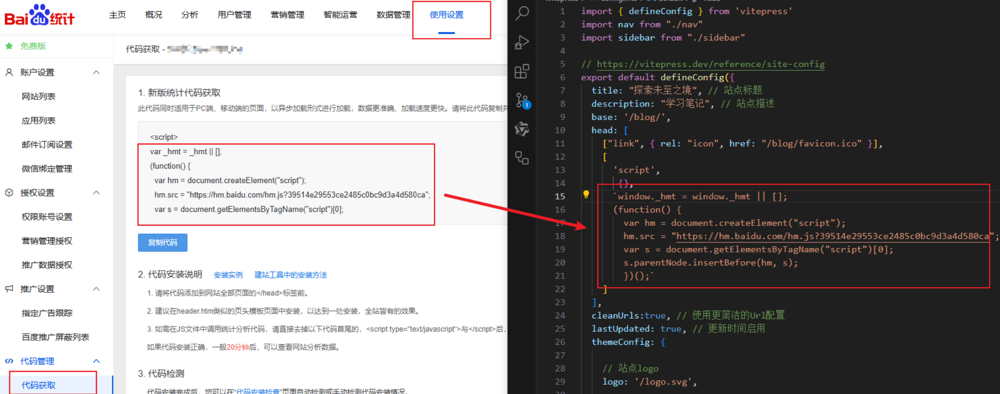
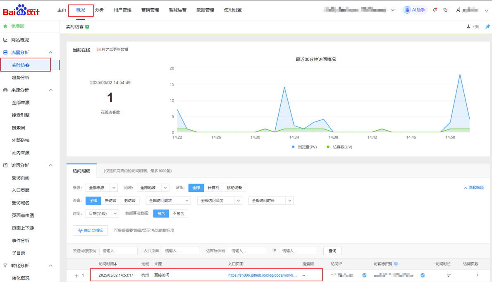

# 访问统计

## 百度统计

### 获取插件代码

​	　访问[百度统计](https://tongji.baidu.com/web5/10000673844/welcome/login)并登录，点击 `进入产品` -> `使用设置` ->`新增网站`，按要求填写后，即可在 `代码管理` - > `代码获取` 中获得所需的统计代码，然后将其复制并粘贴到您要跟踪的网页中。




### 切换路由时申报

​	　由于`VitePress`是静态页面，在切换页面的时候不会触发请求，所以需要在**进入网站时就把这段脚本加上**，而且在**切换页面的时候也需要触发统计**。

::: code-group

```js{3-13} [.vitepress/config.ts]
head: [
    ["link", { rel: "icon", href: "/blog/favicon.ico" }],
    [
      'script',
       {},
      `window._hmt = window._hmt || [];
      (function() { 
        var hm = document.createElement("script"); 
        hm.src = "https://hm.baidu.com/hm.js?39514e29553ce2485c0bc9d3a4d580ca";
        var s = document.getElementsByTagName("script")[0]; 
        s.parentNode.insertBefore(hm, s);
        })();`
    ]
  ],
```

:::

> [!WARNING] 注意
> 这里要将`var _hmt=._hmt || []` 改为 `window._hmt=window._hmt || []` 否则会在`console`提示错误

​	　然后，在 `.vitepress/theme/index.js`中配置**线上环境在切换路径时将访问记录自动申报到百度统计**。

::: code-group

```js [.vitepress/theme/index.js]
import DefaultTheme from 'vitepress/theme'

export default {
  extends: DefaultTheme,
  enhanceApp: ({router}) =>{
    // 只允许线上环境在切换路径时将访问记录自动申报到百度统计
    router.onBeforeRouteChange = (to) => {// [!code ++]
      if(import.meta.env.MODE === 'production') {// [!code ++]
        if( typeof _hmt !== 'undefined' && !!to ){// [!code ++]
          _hmt.push(['_trackPageview', to])// [!code ++]
        }// [!code ++]
      }// [!code ++]
    };// [!code ++]
  }
}
```


```js[参考写法]
import DefaultTheme from 'vitepress/theme'
import Layout from './components/Layout.vue'
import { inBrowser } from "vitepress";//

// 进度条
import { NProgress } from 'nprogress-v2/dist/index.js'/
import 'nprogress-v2/dist/index.css'// 

export default {
  extends: DefaultTheme,
  Layout: Layout,
  enhanceApp: ({router,app}) =>{
    // 切换路由进度条
    if (inBrowser) {
      NProgress.configure({ showSpinner: false }) 
      router.onBeforeRouteChange = (to) => {
        // 开始进度条
        NProgress.start()
        // 线上环境将访问记录自动申报到百度统计
        // 切换路由进度条和统计上报同时使用了onBeforeRouteChange,所以这里写到了一起
        if(import.meta.env.MODE === 'production') {// [!code ++]
          if( typeof _hmt !== 'undefined' && !!to ){// [!code ++]
            _hmt.push(['_trackPageview', to])// [!code ++]
          }// [!code ++]
        }// [!code ++]
      }
      // 停止进度条
      router.onAfterRouteChange = () => {
         NProgress.done() 
       }
    }
  },
}
```


:::

### 配置验证

​	　配置完成后，即可在实时访客页面看到对应的统计信息。PS:这里统计结果的显示是有延迟的。




## 谷歌分析