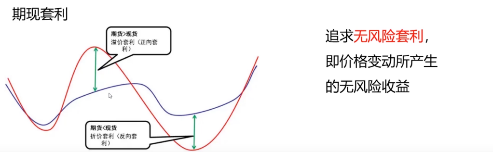
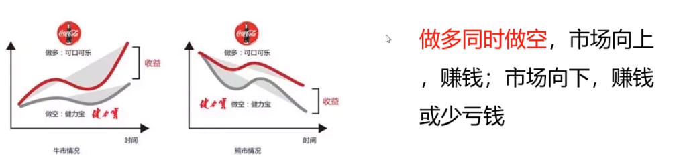
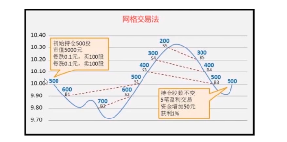
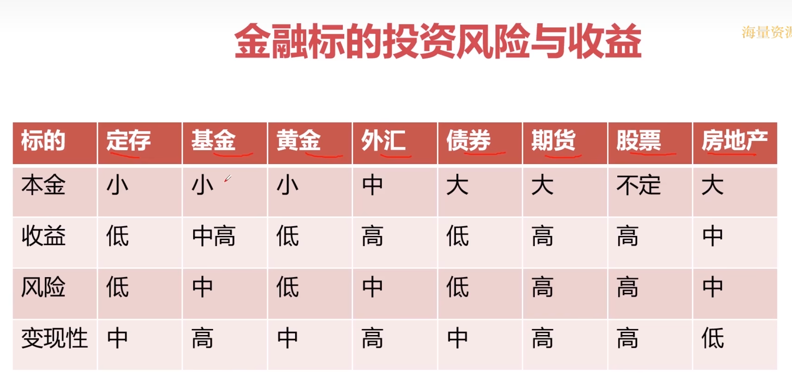
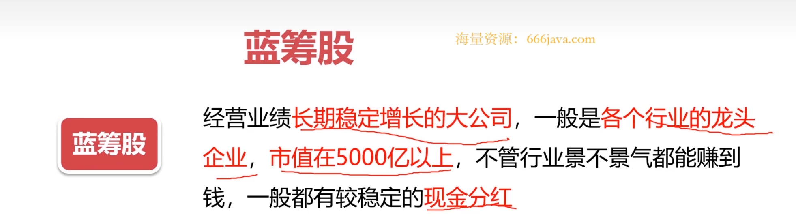

# 基于Python的股票分析与量化交易入门到实践

> [教程地址](https://www.bilibili.com/video/BV1rESFYeEuA?spm_id_from=333.788.videopod.episodes&vd_source=f87f39b1af12eeb6301c7d9944f97ec9)

## 初识量化交易

​	　量化交易是涉及**金融学、数学和编程**的交叉学科。如金融工程、金融衍生品、会计学、概率学、统计学、博弈论、计算机编程、机器学习、大数据都是相关学科。


### 交易流程

```
数据获取->数据清洗
       ↓
策略编写⇌策略回测⇌策略优化
       ↓
模拟盘校验->实盘交易    
```

​	　**数据获取**的获取内容有行情数据、宏观数据、财务数据和舆情数据，获取方式有网站下载、客户端、三方API、爬虫。

​	　**数据清洗**可对垃圾数据清除、空值填充、格式转换、数据对齐等。

​	　**策略编写**首先进行信号捕捉，然后进行交易，如平仓和建仓等操作。

​	　**策略回测**需要经过 回测参数设置->策略实例化->历史数据载入->回测执行->计算盈亏->计算统计指标-生成回测报告。

​	　**策略优化**时需重视交易费、注重风险，重视退出，而且要明白优化永无止境。

​	　**模拟盘**的过去表现并不代表未来结果，故需要进行半年到1年，并获得100%收益，才可以进行实盘交易。

​	　**实盘交易**要做好第一年会输的准备，不要急于扩大投资增加杠杆，保持好心态，一个好的策略是需要 3年到5年才能证明有效的，且过程中仍需不断调整参数。


### 策略分类

```
               ┌ 股票策略  股票
按交易产品分类——| 期权策略  期权
               | CTA策略  期货
               └ FOF策略  FOF
               ┌ 单边多空策略
按盈利模式分类——| 套利策略
               └ 对冲策略
               ┌ 多因子
按策略信号分类——| 交易模型
               └ 机器学习     
```


**1、按交易产品分类**

（1）股票策略盈利模式

​	　股票是指股份公司为筹集资金而发行给各个股东作为持股凭证并借此取得**股息**和**红利**的一种**有价证券**。可以通过**股价波动盈利**。

（2）期权策略盈利模式

​	　期权是一种**选择权**，可以在未来的**某个特定的时间**以**特定的价格买卖**一定数量的**某种特定的商品的权利**。

​	　通过**分期权合约差价** 和 **到期行权收益**。一般都是买入一份低行权价的认购期权，并在高行权价时卖出获利。

（3）CTA策略盈利模式

​	　期货是一种**标准化的合约**，期货交易所统一制定的约定在**未来的某一确定的日期和地点**按照约定的条件**买卖一定数量和质量**的标的资产的标准化合约。

​	　通过**价格趋势**获取利差。价格走势存在反身性，随着市场上涨或下跌的趋势得到加强，而认知上的偏移又会反映到市场上。

（4）FOF策略盈利模式

​	　FOF是基金中的基金，是一种专门投资于其他投资基金的基金，通过资产配置来分散风险、平滑波动、改善组合收益风险化，从而优化投资者的持有体验。尤其是在**震荡的市场**背景下，FOF产品优势尤其明显。


（5）举例子详解

| 购买方式 |      支付金额      | 一年后1100万 | 二年后900万 |    收益率     | 对应方式 |
| :------: | :----------------: | :----------: | :---------: | :-----------: | :------: |
| 全款购房 |       1000万       |    +100万    |   -100万    |     ±10%      |   现货   |
| 按揭购房 |   200万（首付）    |    +100万    |   -100万    |     ±50%      |   期货   |
| 买入指标 |        10万        |    +100万    |   -100万    | 1000% / -100% |   期权   |
| 集资购房 | 1万（占股千分之1） |    0.1万     |   -0.1万    |     ±10%      |   股票   |


**2、按盈利模式分类**

（1）单边多空策略

​	　多用于股票，通过单标买入或单边卖出实现盈利。

（2）套利策略

​	　在金融市场利用某些**金融产品价格与收益率暂时不一致**的机会获得收益的策略。



（3）对冲与对冲策略

​	　对冲是指同时进行两笔**行情相关、方向相反、数理相当、盈亏相抵**的交易。对冲策略是在期货股票市场和股票市场同时进行**等量反向交易**，以锁定既得利润（或成本），通过抵消两个市场的损益来规避股票市场的系统性风险。



**3、按策略信号式分类**

​	　策略信号是指买入或卖出的交易信号。

（1）多因子策略

​	　找到某些和收益率最相关的指标，并根据该指标建立一个股票组合，期望该组合在未来的一段时间跑赢指数（做多）或跑输指数（做空）。

​	　常见的因子项有，资产负债率、资产回报率、每股净收益、净利润增长率、市盈率。

（2）交易模型

​	　基于现代多学科众多理论，以及多种金融技术分析理论，具有普遍性，可盈利可量化可执行的交易系统。



（3）机器学习

​	　从从大量数据中找到某种规律，包括但**不局限于文本数据，图像数据**等，找到可盈利，可量化，可执行的策略信号。区别与传统金融量化策略，可以从更丰富的数据维度中识别策略信号。


## 股票基本知识

​	　股票是指**股份公司**为**筹集资金**而发行给各个股东作为**持股**凭证并借此取得**股息**和**红利**的一种**有价证券**。






https://www.bilibili.com/video/BV1rESFYeEuA/?spm_id_from=333.788.player.switch&vd_source=f87f39b1af12eeb6301c7d9944f97ec9&p=8


